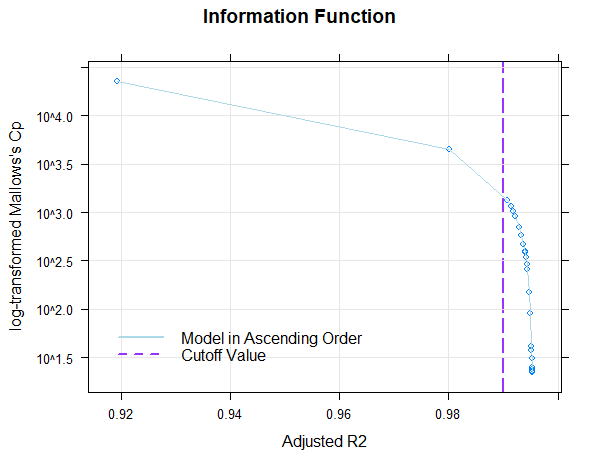
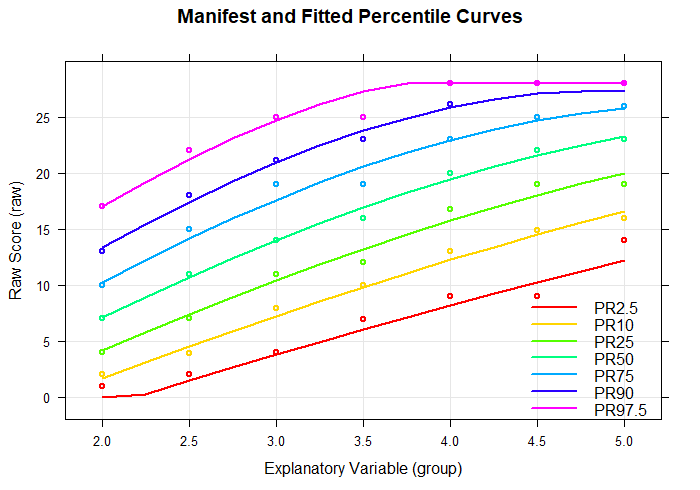

# cNorm

The package cNorm provides methods for generating non-parametric regression based continuous standard scores, as f. e. for psychometric test development, biometrics (biological and (e. g. physiological growth curves), and screenings in the medical domain. It is based on the approach suggested by A. Lenhard et al. (2016). For an in-depth tutorial please consult the project homepage https://www.psychometrica.de/cNorm_en.html

## Approach

Conventional methods for producing test norms are often plagued with "jumps" or "gaps"
(i.e., discontinuities) in norm tables and low confidence for assessing extreme scores.
cNORM addresses these problems and also has the added advantage of not requiring
assumptions about the distribution of the raw data: The standard scores are established from
raw data by modeling the latter ones as a function  of both percentile scores and an
explanatory variable (e.g., age) through Taylor polynomials. The method minimizes
bias arising from sampling and measurement error, while handling marked deviations from
normality – such as are commonplace in clinical samples. Contrary to parametric approaches, it does not rely on distribution assumptions of the initial norm data and is thus a very robust approach in generating norm tables.

## Example

Conducting the analysis consists of four steps:
1.  Data preparation
1.  Establishing the regression model and selecting the parameters
1.  Validating the model
1.  Generating norm tables and plotting the results

cNORM offers function for all of these steps, helps in selecting the best fitting models and in generating the norm tables.

```{r example}
## basic example code for modeling the sample dataset
library(cNORM)
normData <- prepareData(elfe)
model <- bestModel(normData)

# Plot model
plotSubset(model)
plotPercentiles(normData, model)

# print norm table (for grade 3)
normTable(3, model)

# start vignette for a complete walk through
vignette(cNORM-Demo)
```
cNORM offers functions to choose the optimal model, both from a visual inspection of the 
percentiles, as well as by information criteria and model tests:



In this example, a Taylor polynomial with power k = 4 was computed in order to model a sample of the ELFE 1-6 reading comprehension test (sentence completion task; W. Lenhard & Schneider, 2006). In the plot, you can see the share of variance explained by the different models (with progressing number of predictors). Adjusted R2, Mallow's Cp (an AIC like measure) and BIC is used (BIC is available through the option `type = 2`). The predefined adjusted R2 value of .99 is already reached with the third model and afterwards we only get minor improvements in adjusted R2. On the other hand, Cp rapidly declines afterwards, so model 3 seems to be a good candidate in terms of the relative information content per predictor and the captured information (adjusted R2). It is advisable to choose a model at the "elbow" in order to avoid over-fitting, but the solution should be tested for violations of model assumptions and the progression of the percentiles should be inspected visually, as well.




The predicted progression over age are displayed as lines and the manifest data as dots. Only three predictors were necessary to almost perfectly model the norm sample data with adjusted R2.

## Installation
Once it is on CRAN, cNORM can be installed via
```{r example}
install.packages("cNORM", dependencies = TRUE)
```

Until then, you can access the github development version via
```{r example}
install.packages("devtools")
devtools::install_github("WLenhard/cNORM")
library(cNORM)
```

The package is still under development. Please report errors. Suggestions for improvement are always welcome!

## Sample Data
The package includes data from two large test norming projects, namely ELFE 1-6 (Lenhard & Schneider, 2006) and German adaption of the PPVT4 (A. Lenhard, Lenhard, Suggate & Seegerer, 2015), which can be used to run the analysis. Furthermore, large samples from the Center of Disease Control (CDC) on growth curves in childhood and adolescence (for computing Body Mass Index 'BMI' curves) and life expectancy at birth per country from 1960 to 2017 (available from The World Bank). Type `?elfe`, `?ppvt`, `?CDC` or `?life` to display information on the data sets.

## References
*   CDC (2012). National Health and Nutrition Examination Survey: Questionaires, Datasets and Related Documentation. available https://wwwn.cdc.gov/nchs/nhanes/OtherNhanesData.aspx . (date of retrieval: 25/08/2018)
*   Lenhard, A., Lenhard, W., Segerer, R. & Suggate, S. (2015). Peabody Picture Vocabulary Test - Revision IV (Deutsche Adaption). Frankfurt a. M./Germany: Pearson Assessment.
*   Lenhard, A., Lenhard, W., Suggate, S. & Segerer, R. (2016). A continuous solution to the norming problem. Assessment, Online first , 1-14. doi: 10.1177/1073191116656437
*   Lenhard, W., & Schneider, W. (2006). ELFE 1-6: Ein Leseverständnistest für Erst- bis Sechstklässler. Göttingen: Hogrefe. 
*   The World Bank (2018). Life expectancy at birth, total (years). Data Source	World Development Indicators. available https://data.worldbank.org/indicator/sp.dyn.le00.in . (date of retrieval: 01/09/2018)
