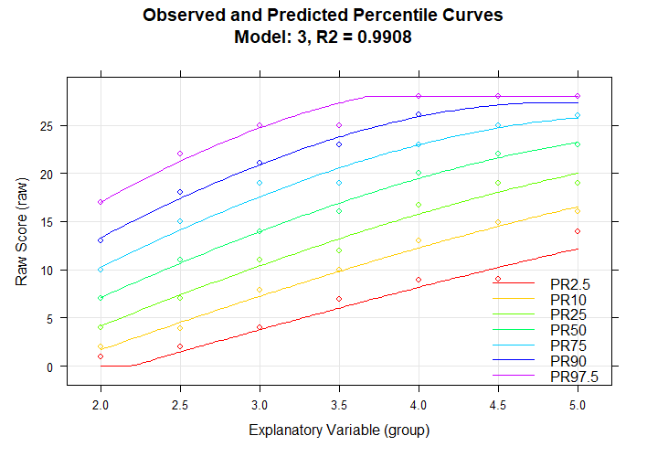

[](https://cran.r-project.org/package=cNORM)
[](https://cran.r-project.org/package=cNORM)


# cNorm

The package cNorm provides methods for generating continuous standard scores, as f. e. for psychometric test development, biometrics (e. g. biological and physiological growth curves), and screenings in the medical domain. It is based on the approach suggested by A. Lenhard et al. (2016, 2019). For an in-depth tutorial please consult the project homepage https://www.psychometrica.de/cNorm_en.html and https://cnorm.shinyapps.io/cNORM/ for an online demonstration.

## Approach

Conventional methods for producing test norms are often plagued with "jumps" or "gaps"
(i.e., discontinuities) in norm tables and low confidence for assessing extreme scores.
cNORM addresses these problems and also has the added advantage of not requiring
assumptions about the distribution of the raw data: The standard scores are established from
raw data by modeling the latter ones as a function  of both percentile scores and an
explanatory variable (e.g., age) through [Taylor polynomials](https://www.psychometrica.de/cNorm_math_en.html). The method minimizes
bias arising from sampling and measurement error, while handling marked deviations from
normality – such as are commonplace in clinical samples. Contrary to parametric approaches, it does not rely on distribution assumptions of the initial norm data and is thus a very robust approach in generating norm tables.

The rationale of the approach is model the relationship between location / norm score, age and raw score via multiple regression and to fit a 3-dimensional hyperplane. This hyperplane is used to close all gaps and to compute continuous norm scores:


## Installation
cNORM can be installed via
```{r example}
install.packages("cNORM", dependencies = TRUE)
```

Additionally, you can [download a precompiled version](https://github.com/WLenhard/cNORM/releases) or access the github development version via
```{r example}
install.packages("devtools")
library(devtools)

devtools::install_github("WLenhard/cNORM")
library(cNORM)
```

Please report errors. Suggestions for improvement are always welcome!

## Example

Conducting the analysis consists of the following steps:
1.  Data preparation and establishing the regression model
1.  Validating the model
1.  Generating norm tables and plotting the results

cNORM offers functions for selecting the best fitting models and in generating the norm tables.

```{r example}
## Basic example code for modeling the sample dataset
library(cNORM)

# Start the graphical user interface (needs shiny installed)
# The GUI includes the most important functions. For specific cases,
# please use cNORM on the console.
cNORM.GUI()

# If you prefer the console, you can use the syntax as well: Rank data within
# group and compute powers and interactions for the internal dataset 'elfe' and compute model.
# The resulting object includes the ranked via object$data and model via object$model.
cnorm.elfe <- cnorm(raw = elfe$raw, group = elfe$group)

# Plot R2 of different model solutions in dependence of the number of predictors
plot(cnorm.elfe, "subset", type=0)        # plot R2
plot(cnorm.elfe, "subset", type=3)        # plot MSE

# NOTE! At this point, you usually select a good fitting model and rerun the process.
# with a fixed number of terms, e. g. four. Try avoid models with a high number of terms:
cnorm.elfe <- cnorm(raw = elfe$raw, group = elfe$group, terms = 4)

#  Visual inspection of the percentile curves of the fitted model
plot(cnorm.elfe, "percentiles")

# Visual inspection of the observed and fitted raw and norm scores
plot(cnorm.elfe, "norm")
plot(cnorm.elfe, "raw")

# In order to check, how other models perform, plot series of percentile plots with ascending
# number of predictors, in this example up to 14 predictors.
plot(cnorm.elfe, "series", end=14)

# Cross validation of number of terms with 20% of the data for validation and 80% training.
# Due to the time intensity, max terms is restricted to 10 in this example; 3 repetitions
cnorm.cv(cnorm.elfe$data, max=10, repetitions=3)

# Cross validation with pre-specified terms, e. g. of an already existing model
cnorm.cv(cnorm.elfe, repetitions=3)

# Print norm table (for grade 3, 3.2, 3.4, 3.6)
normTable(c(3, 3.2, 3.4, 3.6), cnorm.elfe)

# The other way round: Print raw table (for grade 3) together with 90% confidence intervalls
# for a test with a reliability of .94
rawTable(3, cnorm.elfe, CI = .9, reliability = .94)

# Get the predicted norm scores for a vector of raw scores and explanatory variable, e. g. age
predicted <- predictNorm(elfe$raw, elfe$grop, cnorm.elfe)

# cNORM can as well be used for conventional norming
# In this case, the group variable has to be set to FALSE when ranking the data.
d <- rankByGroup(elfe, raw="raw", group=FALSE)
d <- computePowers(d)
m <- bestModel(d)
rawTable(0, model = m) # please use an arbitrary value for age when generating the tables


# In case of unbalanced datasets, deviating from the census, the norm data
# can be weighted by the means of raking / post stratification. Please generate
# the weights with the computeWeights() function and pass them as the weights
# parameter. For computing the weights, please specify a data.frame with the
# population margins (further information is available in the computeWeights
# function). A demonstration based on sex and migration status in vocabulary
# development (ppvt dataset):
margins <- data.frame(variables = c("sex", "sex",
                                    "migration", "migration"),
                      levels = c(1, 2, 0, 1),
                      share = c(.52, .48, .7, .3))
weights <- computeWeights(ppvt, margins)
model <- cnorm(raw = ppvt$raw, group=ppvt$group, weights = weights)


# start vignette for a complete walk through
vignette("cNORM-Demo", package = "cNORM")
```
cNORM offers functions to choose the optimal model, both from a visual inspection of the 
percentiles, as well as by information criteria and model tests:


In this example, a Taylor polynomial with power k = 4 was computed in order to model a sample of the ELFE 1-6 reading comprehension test (sentence completion task; W. Lenhard & Schneider, 2006). In the plot, you can see the share of variance explained by the different models (with progressing number of predictors). Adjusted R2, Mallow's Cp (an AIC like measure) and BIC is used (BIC is available through the option `type = 2`). The predefined adjusted R2 value of .99 is already reached with the third model and afterwards we only get minor improvements in adjusted R2. On the other hand, Cp rapidly declines afterwards, so model 3 seems to be a good candidate in terms of the relative information content per predictor and the captured information (adjusted R2). It is advisable to choose a model at the "elbow" in order to avoid over-fitting, but the solution should be tested for violations of model assumptions and the progression of the percentiles should be inspected visually, as well.




The predicted progression over age are displayed as lines and the manifest data as dots. Only three predictors were necessary to almost perfectly model the norm sample data with adjusted R2.

## Sample Data
The package includes data from two large test norming projects, namely ELFE 1-6 (Lenhard & Schneider, 2006) and German adaption of the PPVT4 (A. Lenhard, Lenhard, Suggate & Seegerer, 2015), which can be used to run the analysis. Furthermore, large samples from the Center of Disease Control (CDC) on growth curves in childhood and adolescence (for computing Body Mass Index 'BMI' curves), life expectancy at birth and mortality per country from 1960 to 2017 (available from The World Bank). Type `?elfe`, `?ppvt`, `?CDC`, `?epm`, `?mortality` or `?life` to display information on the data sets.

## Terms of use / License
cNORM is licensed under GNU Affero General Public License v3 (AGPL-3.0). This means that copyrighted parts of cNORM can be used free of charge for commercial and non-commercial purposes that run under this same license, retain the copyright notice, provide their source code and correctly cite cNORM. Copyright protection includes, for example, the reproduction and distribution of source code or parts of the source code of cNORM or of graphics created with cNORM. The integration of the package into a server environment in order to access the functionality of the software (e.g. for online delivery of norm scores) is also subject to this license. However, a regression function determined with cNORM is not subject to copyright protection and may be used freely without preconditions. If you want to apply cNORM in a way that is not compatible with the terms of the AGPL 3.0 license, please do not hesitate to contact us to negotiate individual conditions. If you want to use cNORM for scientific publications, we would also ask you to quote the source.

## References
*   Gary, S. & Lenhard, W. (2021). In norming we trust. Diagnostica.
*   Lenhard, A., Lenhard, W., Segerer, R. & Suggate, S. (2015). Peabody Picture Vocabulary Test - Revision IV (Deutsche Adaption). Frankfurt a. M./Germany: Pearson Assessment.
*   Lenhard, A., Lenhard, W., Suggate, S. & Segerer, R. (2016). A continuous solution to the norming problem. Assessment, Online first, 1-14. doi:10.1177/1073191116656437
*   Lenhard, A., Lenhard, W., Gary, S. (2018). Continuous Norming (cNORM). The Comprehensive R Network, Package cNORM, available: https://CRAN.R-project.org/package=cNORM
*   Lenhard, A., Lenhard, W., Gary, S. (2019). Continuous norming of psychometric tests: A simulation study of parametric and semi-parametric approaches. PLoS ONE, 14(9),  e0222279. doi:10.1371/journal.pone.0222279
*   Lenhard, W., & Lenhard, A. (2020). Improvement of Norm Score Quality via Regression-Based Continuous Norming. Educational and Psychological Measurement(Online First), 1-33. https://doi.org/10.1177/0013164420928457

