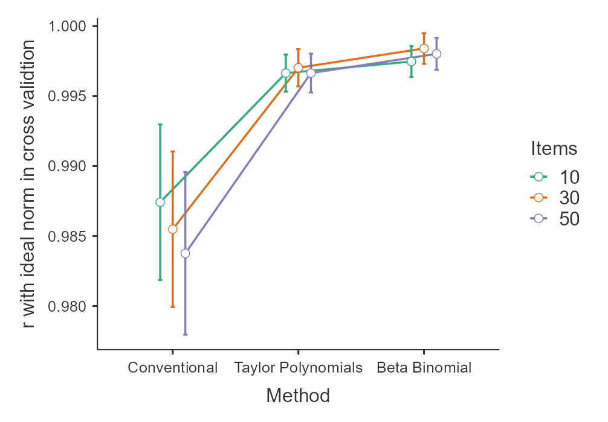

---
title: "Modelling Psychometric Data with Beta-Binomial Distributions"
author: "Wolfgang Lenhard & Alexandra Lenhard"
date: "`r Sys.Date()`"
output: rmarkdown::html_vignette
vignette: >
  %\VignetteIndexEntry{Modelling Psychometric Data with Beta-Binomial Distributions}
  %\VignetteEngine{knitr::rmarkdown}
  %\VignetteEncoding{UTF-8}
---

```{r setup, include = FALSE}
knitr::opts_chunk$set(
  collapse = TRUE,
  comment = "#>"
)
```

## Introduction

An alternative to distribution-free modeling of norm data is parametric modeling. In this approach, the parameters of specific distribution functions (e.g., normal distribution, Box-Cox power function, beta-binomial distribution, etc.) are adjusted across age. One challenge with this approach is finding a function that fits the manifest data well. Note that for the normal distribution, this is usually not the case (cf. A. Lenhard et al., 2019).

In certain cases, however, the beta-binomial distribution is excellently suited for modeling norm scores. This is especially true for psychometric test scales with a fixed number of questions or items that are completed without time constraints, and where each individual item can only be scored as 0 or 1.

As the name suggests, the beta-binomial distribution combines the binomial distribution with the beta distribution. The binomial distribution can be used to determine the probability of achieving x successes in n trials. The binomial distribution assumes a constant probability of success. However, this is usually not the case in psychometric test scales, especially in performance tests. This is where the beta distribution comes into play. In the beta-binomial distribution, it is assumed that the probability of success is not constant, but that the item difficulties follow a beta distribution. The latter does not represent a specific distribution, but a family of distributions determined by two shape parameters $\alpha$ and $\beta$. Although the item difficulties in most test scales are probably not exactly beta-distributed, test results can usually be modeled very well with the beta-binomial distribution, at least for unspeeded tests.

Since version 3.2, cNORM is not only able to model psychometric data across age using Taylor polynomials, but also using the beta-binomial distribution. In the following we will show the mathematical derivation, explain the requirements, demonstrate a practical modeling example and present the results of a simulation study.


## Mathematical Derivation
The beta-binomial distribution is a combination of the binomial and the beta distribution. For a test with n items, which are scored dichotomously with 0 (= false) and 1 (= correct), let X be the number of correct responses. The probability function of the beta-binomial distribution is given by: 

\[P(X = k | n, \alpha, \beta) = \binom{n}{k} \frac{B(k + \alpha, n - k + \beta)}{B(\alpha, \beta)}\]

where $B(\cdot,\cdot)$ is the beta function, and $\alpha$ and $\beta$ are shape parameters of the beta distribution.

We model the shape parameters $\alpha$ and $\beta$ of the beta-binomial distribution as functions of age (or another explanatory variable) using polynomial regression. Specifically: 

\[\log(\alpha(age)) = a_0 + a_1age + a_2age^2 + ... + a_mage^m\]
\[\log(\beta(age)) = b_0 + b_1age + b_2age^2 + ... + b_sage^s\]

where m and s are the degrees of the polynomials for $\alpha$ and $\beta$ respectively. We use the logarithm of $\alpha$ and β to ensure that they are positive, since the beta-binomial distribution is only defined for positive $\alpha$ and $\beta$. This transformation also helps in stabilizing the variance and improving the optimization process. The mean $\mu$ and variance $\sigma^2$ of the beta-binomial distribution can be derived from $\alpha$ and $\beta$ as follows: 

\[\mu = \frac{n\alpha}{\alpha + \beta}\]
\[\sigma^2 = \frac{n\alpha\beta(\alpha + \beta + n)}{(\alpha + \beta)^2(\alpha + \beta + 1)}\]

To estimate the parameters ($a_0, ..., a_m, b_0, ..., b_s$), we use maximum likelihood estimation. The log-likelihood function for N observations is:

\[L(a, b | X, Age) = \sum_{i=1}^N \log[P(X_i | n, \alpha(Age_i), \beta(Age_i))]\]

where $X_i$ is the score and $Age_i$ is the age for the i-th observation.

The data fitting is performed using numerical optimization techniques, specifically the L-BFGS-B (Limited-memory BFGS) algorithm of the 'optim' function. The latter is a quasi-Newton method for solving large nonlinear optimization problems with simple bounds. By approximating the Hessian matrix, it simultaneously determines the coefficients of the regression equations for $\alpha$ and $\beta$ that maximize the log-likelihood, thus providing the best fit to the observed data.


## Prerequisites
To our knowledge, it has not yet been systematically investigated empirically under which circumstances the beta-binomial distribution yields the best results and when distribution-free modeling should be preferred. Nevertheless, there are some requirements that should be fulfilled if you want to use the beta-binomial distribution when modeling your data with the cNORM package.


- **Systematic development across age or the explanatory variable**: The test raw scores must show a systematic, but not necessarily monotonic, development across age (resp. the explanatory variable). By default, the modeling can capture nonlinear relationships across age. This applies to both the development of the mean and the standard deviation of the raw scores. For more complex trajectories, the polynomial degrees for age adjustment of both shape parameters can be increased. However, ensure that sufficiently large sample sizes are available in these cases to avoid overfitting.

- **Discrete outcomes**: Only positive integers including zero are permitted as test raw scores. Decimal numbers, fractions or negative scores are not suitable for fitting with the beta-binomial distribution.

- **Fixed maximum score**: The test should have a predefined maximum score or a fixed number of items. It cannot be ruled out that the beta-binomial distribution also works for test scales with an open-ended score. However, the beta-binomial distribution assumes, at least theoretically, that there is a discrete number of trials and therefore also a maximum number of successes.

- **No time contraints**: The test in question should be unspeeded. At least theoretically, the beta-binomial distribution assumes that the raw score distribution depends solely on the distribution of the item difficulties and the number of items. However, in speeded tests, the probability of solving an item also depends on its position within the test. For example, people with low processing speed are less likely to solve an item far back in the test than would be expected based on the item difficulty alone. In line with this hypothesis, we observed in simulation studies that the fit of the beta-binomial distribution deteriorates as the speed component of a test increases.

- **Size and representativeness of the norm sample**: As always, the result of norm score modeling depends on the quality of the norm data. The norm sample should be representative of the reference population and it should be large enough to sufficiently capture the variability of the personality trait to be measured. Slight to moderate deviations of the standard sample from representativeness can be partially corrected by post-stratification and weighting. However, this is not necessarily guaranteed in the case of strong deviations. For continuous norming, a minimum of 100 cases per age cohort is generally recommended. This recommendation results from the need to be able to estimate the parameters of the model reliably enough. However, if several stratification variables are used or if the relation between raw score distribution and explanatory variable is complex, larger samples may also be necessary.

- **Absence of outliers or influential observations**: It is crucial to examine the data for outliers prior to modeling, as these anomalous points could disproportionately influence the model fit. Such outliers may arise from data entry errors or invalid test conditions. If such reasons are identified, the affected data points should be excluded from the modeling process. (Note that it is important to document any data exclusions and provide justification for their removal to maintain transparency in the analysis.)


## Modeling Example

In the following, we will demonstrate parametric continous norming based on the beta-binomial distribution using the example of the development of receptive vocabulary in childhood and adolescence. For this purpose, we have integrated a data set into cNORM that was collected using the German version of the Peabody Picture Vocabulary Test 4 (PPVT-4). If you would like to reproduce the modeling yourself please make sure that you have installed a current version of cNORM.

### Data Preparation
With the following code you can load the cNORM library and view the structure of the ppvt data set:

```{r fig0, fig.height = 4, fig.width = 7}
 ## Loads the package and displays the data

library(cNORM)
str(ppvt)
plot(ppvt$age, ppvt$raw, main="PPVT Raw Scores by Age",
              xlab="Age", ylab="Raw score")
```

The dataset contains two columns that encode the explanatory variable: a continuous age variable and a discrete group variable (see also Data Preparation). The latter is primarily used for visualization purposes in parametric norming. Furthermore, the dataset includes the raw score and three background variables that can be used for stratification or weighting, namely sex, migration, and region.

The 'Raw Scores by Age' plot exhibits a pronounced curvilinear pattern, which is characteristic of vocabulary development. A rapid increase in scores is observed during the preschool years, followed by a deceleration of growth during adolescence.

We will initially conduct the modeling without stratification or weighting.

### Model Fitting
To fit the beta-binomial distribution to the data, we employ the 'cnorm.betabinomial()' function. You have to specify the variables 'age' for the explanatory variable and 'score' for the raw score to be modeled. Additionally, it is necessary to indicate the number of items, which for the PPVT-4, is 228. Note that it is important to employ the actual number of items here, not the maximum achievable score.

```{r fig1, fig.height = 4, fig.width = 7}
# Models the data across a continuos explanatroy variable such as age,
# thereby assuming that the raw scores follow a beta-binomial distribution
# at a given age level:

model.betabinomial <- cnorm.betabinomial(age = ppvt$age, score = ppvt$raw, n = 228)
```

Fit indices can be obtained using the 'diagnostic.betabinomial()' function or the 'summary()' function. If the age variable and raw score variable are additionally specified, the output will also include R2, RMSE, and bias in relation to the observed data.

```{r}
# Provides fit indices

diagnostics.betabinomial(model.betabinomial, age = ppvt$age, score = ppvt$raw)
```

By default, the function fits a third-degree polynomial for both $\alpha$ and $\beta$. However, you can also specify the degrees of the polynomials yourself. Use the parameters 'alpha' and 'beta' for this purpose. When the 'mode' parameter of the function is set to 1, the adjustment is performed using the parameters for mean and standard deviation ($\mu$ and $\sigma$) instead of $\alpha$ and $\beta$. If the number of items is not specified using the 'n' parameter, the function will use the maximum raw score (which we do not recommend).

Norm scores are returned as T-scores by default, but IQ scores, z-scores, percentiles, or customized norm scores specified by a vector 'c(M, SD)' are also possible.

By default, a plot of the manifest and modeled percentile curves is returned, too. Diagramms can also be generated using the 'plot()' function. As with distribution-free modeling, it is always important to have a close look at the percentile curves. Wavy patterns indicate overfitting.

To determine norm scores, please use the 'predict()' function and provide the model object along with a vector for the desired age levels and raw scores. Please use the midpoint of the desired age interval to specify age. In the example, T-scores for 10-year-old children are provided in 3-month intervals for the raw score 200.

```{r}
# Provides norm scores for specified age levels and raw scores.
# If not specified otherwise in the model, the norm scores will
# be returned as T-scores.

predict(model.betabinomial, c(10.125, 10.375, 10.625, 10.875), c(200, 200, 200, 200))
```


### Post stratification and weighting
Post-stratification is a method in which individual cases are weighted after data collection is complete, aiming to minimize deviations from representativeness in the sample. In parametric modeling, such weights can be applied in the same way as in distribution-free modeling. The 'computeWeights()' function calculates the necessary weights using a technique called 'raking'. In this example, we weight individual cases to account for population proportions of gender and immigration status when computing the model. Consequently, the resulting norm scores should better represent the target population compared to the unweighted model.

```{r fig2, fig.height = 4, fig.width = 7}
# Calculates weights and models the data:

margins <- data.frame(variables = c("sex", "sex",
                    "migration", "migration"),
                    levels = c(1, 2, 0, 1),
                    share = c(.52, .48, .7, .3))
weights <- computeWeights(ppvt, margins)
model_weighted <- cnorm.betabinomial(ppvt$age, ppvt$raw, weights = weights)

```

These norm tables provide the raw scores (x), their probabilities (Px), the cumulative probabilities (Pcum), percentiles, z-scores, and norm scores (if not specified otherwise: T-scores) and in this specific case the 95%-confidence intervals with respect to the norm score and percentile.

Please consult the vignette on `WeightedRegression` for more information on post-stratification and weighting techniques.


### Generation of Norm tables
Norm tables can be generated using the 'normTable.betabinomial()' function. This function requires the model object and an age specification or a vector with multiple age specifications for which you want to generate norm tables. When specifying ages, please note that the midpoint of the desired age interval should be used. In this example, norms for 14-year-old children are provided in 6-month intervals. If a confidence coefficient and a reliability coefficient are additionally specified in the 'normTable.betabinomial()' function, the table will be returned with confidence intervals. By default, the function limits the norm scores to +/- 3 standard deviations.

```{r}
# Generates norm tables for age 14.25 and 14.75 and computes 95%-confidence
# intervals with a reliability of .97.

tables <- normTable.betabinomial(model.betabinomial, c(14.25, 14.75), CI = .95, reliability = .97)
head(tables[[1]]) # head is used to show only the first few rows of the table
```

These norm tables provide the raw scores (x), their probabilities (Px), cumulative probabilities (Pcum), percentiles, z-scores, and norm scores (in this case, T-scores) and in this specific case the confidence intervals for the norm score and the percentiles for each age. This allows for the interpretation of an individual's raw score in relation to their age group.


## Simulation Study

In simulation studies (W. Lenhard & Lenhard, 2021), we demonstrated that distribution-free continuous norming using Taylor polynomials, as applied in cNORM, is significantly superior to conventional norming methods. This superiority was more pronounced with smaller normative samples. Only with unrealistically large samples did the relevant difference between continuous and conventional norming disappear. In another simulation study (A. Lenhard et al., 2019), we compared distribution-free with parametric norming. These investigations showed no general superiority of one method over the other. Instead, the quality of norming depended on the raw score distribution and sample size. A crucial factor for norming quality was whether an appropriate distribution could be found in parametric norming that fit the raw score distributions within each individual age group. However, the beta-binomial distribution was not included in our simulation study at that time.

Recent publications by Urban et al. (2024) have now shown that parametric modeling using the beta-binomial distribution can very effectively approximate the norm scores of some typical psychological test scales. Our own (unpublished) simulations with 1-PL IRT scales also pointed in this direction.

With the simulation study presented below, we aim to extend our previous results comparing parametric and distribution-free modeling to include the beta-binomial distribution. The simulations exclusively modeled scales without time limitations (i.e., without speed effects). In theory, the beta-binomial distribution should be particularly well-suited for modeling these scales.

Our simulation includes scales of varying difficulty and item numbers, and normative samples of different sizes.

We conducted five simulation runs with the following parameters:

- Number of items: 10, 30, and 50

- Scale difficulty: easy, medium, and hard

- Sample sizes: 700, 1,400, 2,800, and 5,600 cases across 7 age groups

- Cross-validation sample: 70,000 cases

In the results, we compare conventional norming with 6-month intervals, distribution-free continuous norming, and parametric continuous norming by means of beta-binomial distribution. The resulting norm scores for each method are compared with manifest T-scores simulated for an ideally representative, large population using an IRT process. This approach allows us to assess model quality while minimizing biases that occur in real norming studies. Since the person parameters are known in the simulation, we can calculate the mean bias, Root Mean Square Error (RMSE), R2, and Mean Absolute Difference (MAD) for each norming method. For simplicity, we will focus on R2 in the cross-validation sample in the following. However, detailed results and the complete simulation code are available in our [OSF repository](https://osf.io/hcg7v/).


### Results and discussion



Our results demonstrate that parametric continuous norming with beta-binomial distribution performs exceptionally well for the simulated scales. Even with relatively small samples, it closely approximates the 'ideal' norm scores simulated for the large and representative cross-validation sample. Parametric norming with the beta-binomial distribution is markedly superior to conventional norming with 6-month intervals. In fact, for the simple 1-PL scales simulated here, it performs even slightly better than distribution-free continuous norming with Taylor polynomials. However, the differences between the two continuous methods are so minimal that they are unlikely to have practical significance in most cases.

Moreover, based on the results presented here, it cannot be assumed that parametric norming using the beta-binomial distribution generally yields better results than distribution-free continuous norming. At least in unsystematic simulations for individual age groups, we found a better fit with Taylor polynomials for speeded test scales. We are currently preparing additional systematic simulations, the results of which we will report as soon as possible.


## Conclusion: When to Use What?

A diverse methodological toolkit is invaluable in psychometrics. Taylor polynomials, as implemented in cNORM, have proven effective in a wide range of norming scenarios. Their distribution-free nature makes them applicable to various tests, including those with continuous or negative raw scores. Parametric modeling with beta-binomial distribution, on the other hand, is particularly well-suited for unspeeded tests with dichotomous items and fixed maximum scores. Both methods yield significantly better results than conventional norming for typical sample sizes and should therefore be preferentially applied in test construction.

The choice between these approaches should be guided by the following factors:

1. Characteristics of raw scores (e.g., discrete vs. continuous raw scores, negative values)
2. Test scale features (e.g., speeded vs. unspeeded)

Regardless of the method used, it is always necessary to thoroughly evaluate the model fit and transparently report its quality in the test manuals. Particular attention should be paid to the shape of the percentile curves, which should align with theoretical expectations. For instance, wavy percentile curves are generally not expected. Such a pattern indicates overfitting and should be avoided. In such cases, review the model parameters or employ an alternative modeling approach.

In summary, both distribution-free and parametric continuous norming with cNORM offer significant advantages over conventional norming. The specific choice between the two continuous norming methods should be made through careful consideration of the test type and available data.

## References
* Lenhard, A., Lenhard, W. & Gary, S. (2019). Continuous norming of psychometric tests: A simulation study of parametric and semi-parametric approaches. PLoS ONE, 14(9), e0222279. https://doi.org/10.1371/journal.pone.0222279
* Lenhard, W., & Lenhard, A. (2021). Improvement of Norm Score Quality via Regression-Based Continuous Norming. Educational and Psychological Measurement, 81(2), 229-261. https://doi.org/10.1177/0013164420928457
* Urban, J., Scherrer, V., Strobel, A., & Preckel, F. (2024). Continuous Norming Approaches: A Systematic Review and Real Data Example. Assessment. https://doi.org/10.1177/10731911241260545


