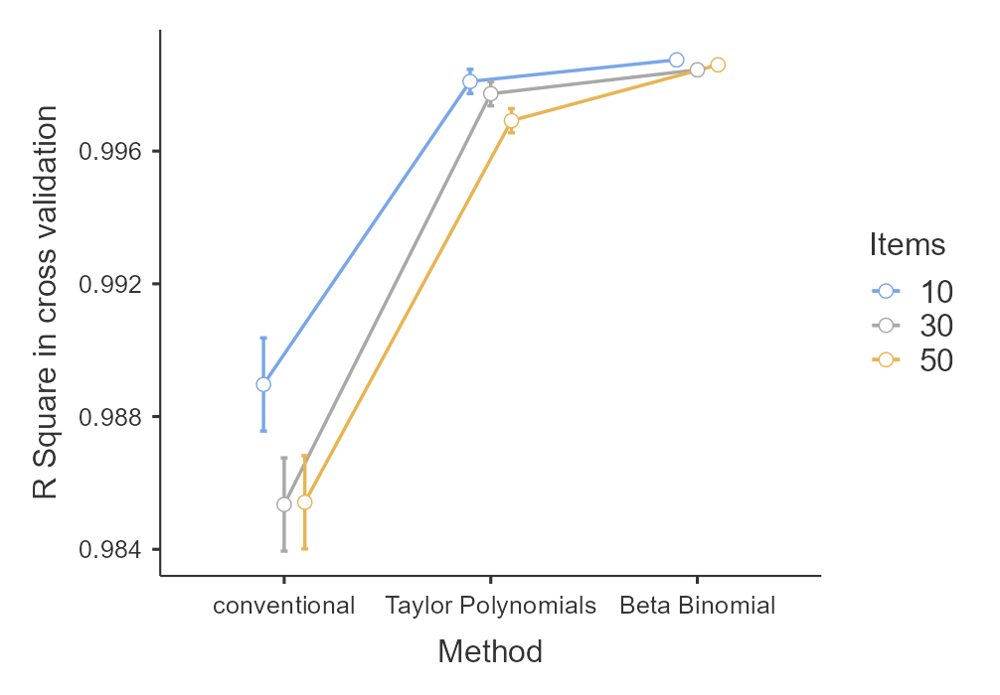

---
title: "Modeling Psychometric Data with Beta Binomial Functions"
author: "Wolfgang Lenhard & Alexandra Lenhard"
date: "`r Sys.Date()`"
output: rmarkdown::html_vignette
vignette: >
  %\VignetteIndexEntry{Modeling Psychometric Data with Beta Binomial Functions}
  %\VignetteEngine{knitr::rmarkdown}
  %\VignetteEncoding{UTF-8}
---

```{r setup, include = FALSE}
knitr::opts_chunk$set(
  collapse = TRUE,
  comment = "#>"
)
```

## Introduction

In this vignette, we demonstrate how to model psychometric data over age using beta binomial distributions. We'll cover the theoretical background, provide practical examples, and showcase the capabilities through a simulation study.

The beta-binomial distribution is a powerful approach for modeling psychometric test scores with a fixed maximum score and discrete outcomes. In psychometric testing, we often encounter situations where individuals answer a set number of questions or items, resulting in whole-number scores bounded by zero and the maximum possible score. The probability of answering each question correctly varies among individuals due to factors like ability or personal traits. 

To quantify this ability or trait, norm scores are used to express the relative location of an individual's score within a reference population. This allows for meaningful interpretation and comparison of test results across different age groups or populations. The beta-binomial distribution combines the binomial distribution, which models the count of correct answers in a fixed number of trials, with the beta distribution, which accounts for the variability in the probability of success. 

## Mathematical Derivation
The beta-binomial distribution arises as a compound distribution of the binomial and beta distribution. For a test with n items, which are scored dichotomously with 0 (= false) and 1 (= correct), let X be the number of correct responses. The probability mass function of the beta-binomial distribution is given by:

\[P(X = k | n, \alpha, \beta) = \binom{n}{k} \frac{B(k + \alpha, n - k + \beta)}{B(\alpha, \beta)}\]

where $B(\cdot,\cdot)$ is the beta function, and $\alpha$ and $\beta$ are shape parameters of the beta distribution.

We directly model the $\alpha$ and $\beta$ parameters of the beta-binomial distribution as functions of age (or another explanatory variable) using polynomial regression. Specifically:

\[\log(\alpha(age)) = a_0 + a_1age + a_2age^2 + ... + a_mage^m\]
\[\log(\beta(age)) = b_0 + b_1age + b_2age^2 + ... + b_sage^s\]

where m and s are the degrees of the polynomials for $\alpha$ and $\beta$ respectively.
We use the log of $\alpha$ and $\beta$ to ensure positivity of these parameters, as they must be positive for the beta-binomial distribution. This transformation also helps in stabilizing the variance and improving the optimization process.

The mean ($\mu$) and variance ($\sigma^2$) of the beta-binomial distribution can be derived from $\alpha$ and $\beta$ as follows:

\[\mu = \frac{n\alpha}{\alpha + \beta}\]
\[\sigma^2 = \frac{n\alpha\beta(\alpha + \beta + n)}{(\alpha + \beta)^2(\alpha + \beta + 1)}\]

To estimate the parameters ($a_0, ..., a_m, b_0, ..., b_s$), we use maximum likelihood estimation. The log-likelihood function for N observations is:

\[L(a, b | X, Age) = \sum_{i=1}^N \log[P(X_i | n, \alpha(Age_i), \beta(Age_i))]\]

where $X_i$ is the score and $Age_i$ is the age for the i-th observation.

This log-likelihood is jointly optimized over all parameters using numerical optimization techniques, specifically the L-BFGS-B (Limited-memory BFGS) algorithm of the optim function. The L-BFGS-B algorithm is a quasi-Newton method for solving large nonlinear optimization problems with simple bounds. It's particularly effective for our problem as it can handle a large number of parameters and allows for bound constraints, which can be useful to ensure the positivity of $\alpha$ and $\beta$. The optimization process finds the values of $a$ and $b$ that maximize the log-likelihood through approximating the Hessian matrix, thereby providing the best fit to the observed data.

This direct modeling of $\alpha$ and $\beta$ allows for flexibly capturing the shape of the beta-binomial distribution across different ages, potentially leading to the best fit for complex data patterns.


## Prerequisites
Before applying beta-binomial modeling to psychometric data over age, several key prerequisites should be met:

- **Systematic development over age resp. the explanatory variable**: The scores must show a systematic, but not necessarily monotonic development over age (resp. the explanatory variable). By default, the modeling can capture curvilinear relationships for both $\mu$ and $\sigma$. In case of more complex trajectories, the polynomial degrees for both parameters can be increased. This however requires larger sample sizes and entails the danger of overfitting.

- **Discrete outcomes**: The test scores must be distinct, whole number values. For example, scores like 0, 1, 2, ..., n are appropriate. Fractional or continuous scores are not suitable for the beta binomial model.

- **Fixed maximum score**: The test must have a predetermined maximum score or a fixed number of items with a consistent upper bound across all age groups.

- **Item difficulty distribution**: The difficulty of the test items should ideally be normally distributed. This helps ensure that the test can discriminate well across the entire range of abilities.

- **Size and representativeness of the norm sample**: As always, the result of norm score modeling depends on the quality of the norm sample data. The sample should be large enough to capture the variability in the test scores and representative of the population of interest. In continuous norming, usually a minimum of 100 cases per age cohort is recommended. This recommendation is based on the need to have sufficient data to reliably estimate the parameters of the model, especially when using higher-degree polynomials. Strong deviations from the population will lead to biased norm scores. Mild to moderate deviations can be partly corrected by post-stratification or weighting.

- **Absence of outliers or influential observations**: It's important to check for and handle any outliers or influential observations that could disproportionately affect the model fit. These could be due to data entry errors, unusual testing conditions, or genuinely extreme performances.

## Example

Let's walk through a practical example using the ppvt dataset, included in cNORM. Before we begin, ensure you have installed the cNORM package.

### Data Preparation
The ppvt dataset included in cNORM contains data on vocabulary development over age, specifically scores from the Peabody Picture Vocabulary Test. This test measures receptive vocabulary and is widely used in psychological and educational assessments. Let's load the data and examine its structure:

```{r fig0, fig.height = 4, fig.width = 7}
library(cNORM)
str(ppvt)
max(ppvt$raw)
plot(ppvt$age, ppvt$raw, main="PPVT Raw Scores by Age", xlab="Age", ylab="Raw Score")
```

The development over age shows a strong curvilinear trajectory, which is typical for vocabulary development. We observe a rapid increase in scores during early childhood, followed by a more gradual increase in later years. The dataset contains several columns including background variables, a raw score variable, age, and age group. We will use the continuous age variable for modeling the vocabulary development, initially without using stratification or weighting.

### Model Fitting
To fit the beta-binomial model to the data, we use the `cnorm.betabinomial` function. This function takes the age and raw score variables as input and returns the model object. Here's how you can fit the model:

```{r fig1, fig.height = 4, fig.width = 7}
# Data can be fitted over a continuous variable like age without the prerequisite of defining
# age groups. We will use the data on vocabulary development (ppvt) included in cNORM. The test
# has a maximum score of 228, which is however not reached in the sample:
model.betabinomial <- cnorm.betabinomial(ppvt$age, ppvt$raw, n = 228)

# In order to use different optimization functions, you can specify different 
# control parameters, # e.g., including methods from the optimx package. 
# The default is the BFGS algorithm.

# To retrieve fit indices, use the diagnostic.betabinomial function
diagnostics.betabinomial(model.betabinomial)

```

By default, the function fits a polynomial of degree 3 for both $\mu$ and $\sigma$. You can specify the degrees of the polynomials using the `degree_mu` and `degree_sigma` arguments. By default, norm scores are set to T scores, but IQ, z, percentiles and custom standard scores (use `c(M, SD)` for specification) are possible as well. If the maximum score is not provided via the n parameter, the function will resort to `max(raw)`.

`cnorm.betabinomial` already displays a plot of the raw scores and the percentile curves. This can also be done manually using the `plot.betabinomial` function. Observe if the percentile trajectories exhibit plausible forms. To predict the norm scores for new data, please use the predictNorm.betabinomial function and provide the model object together with a vector for age and raw scores:

```{r}
# Predict norm scores for new data. Since we used the default T-score scaling,
# the output will as well be a vector with T-scores. 
predictNorm.betabinomial(c(123, 98, 201, 165), c(8.9, 10.1, 9.3, 8.7), model.betabinomial)
```


### Norm table generation
Norm tables can be generated with the `normTable.betabinomial` function. The function takes the model object and a vector of ages for which you want to generate norm scores. If available, reliability can be specified to compute confidence intervals as well. By default, the function limits the results to +/- 3 standard deviations.

```{r}
# Generate norm tables for age 2, 3 and 4 and compute confidence intervals with a 
# reliability of .9. The output is by default limited to +/- 3 standard deviations.
tables <- normTable.betabinomial(model.betabinomial, c(2, 3, 4), reliability=0.9)
head(tables[[1]]) # head is used to show only the first few rows of the table
```

These norm tables provide the raw scores (x), their probabilities (Px), cumulative probabilities (Pcum), percentiles, z-scores, and norm scores (in this case, T-scores) and in this specific case the confidence intervals for the norm score and the percentiles for each age. This allows for the interpretation of an individual's raw score in relation to their age group.

### Post stratification and weighting
In modeling with the beta binomial function, just like in `cnorm`, weights can be applied as a means for post-stratification. Post-stratification is a technique used to adjust the sample data to better represent the population, which can help correct for sampling biases. Please use the raking function `computeWeights`. Here's an example for the ppvt dataset:

```{r fig2, fig.height = 4, fig.width = 7}
margins <- data.frame(variables = c("sex", "sex",
                                   "migration", "migration"),
                      levels = c(1, 2, 0, 1),
                      share = c(.52, .48, .7, .3))
weights <- computeWeights(ppvt, margins)
model_weighted <- cnorm.betabinomial(ppvt$age, ppvt$raw, n = 228, weights = weights)

```

In this example, we're adjusting the sample to match population proportions for sex and migration status. The resulting weighted model should provide norm scores that better represent the target population.

Please consult the vignette on `WeightedRegression` for more information on post-stratification and weighting techniques.


## Simulation Study

Recent research by Urban et al. (2024) has demonstrated that regression-based modeling with beta-binomial distributions can effectively approximate norm scores of psychological tests in many scenarios. Our study replicates and extends the work of Lenhard & Lenhard (2021), which assessed the performance of semi-parametric regression models for norm score estimation as applied in cNORM, comparing it with conventional norming methods. cNORM demonstrated superior performance even with small sample sizes. The simulated scales in this study were constructed to align with scenarios where beta-binomial modeling is expected to perform well, particularly given the normal distribution of item difficulties. Thus, we wanted to replicate our results, including beta binomial distributions as outlined above.

The complete simulation code and detailed results are available in our [OSF repository](https://osf.io/hcg7v/). Our methodology involves simulating scales of varying difficulty and item numbers, applying these to norming samples of different sizes. The resulting models are then tested against an ideal, large population where the latent ability and true T-score are known, based on the IRT simulation process. This approach allows us to assess model quality while minimizing the noise inherent in real-world norming studies. Furthermore, with all person parameters known, we can evaluate the models in terms of bias, Root Mean Square Error (RMSE), and coefficient of determination ($R^2$).

We conducted five simulation runs with the following parameters:

- Number of items: 10, 30, and 50

- Scale difficulty: easy, medium, and hard

- Sample sizes: 700, 1,400, 2,800, and 5,600 cases across 7 age groups

- Cross-validation sample: 70,000 cases

In the results data, SCPM refers to cNORM with Taylor polynomials, numeric values indicate conventional norming with varying norm group interval sizes in month, and 'beta' denotes the beta-binomial models. The 'rCrossT_' prefix indicates the correlation between actual and fitted T-scores in the cross-validation sample.

### Results

Our findings demonstrate that beta-binomial models perform robustly in terms of bias, RMSE, and $R^2$, even with relatively small sample sizes. Their performance is comparable to or better than Taylor polynomials and significantly superior to conventional norming methods:




## Conclusion: When to Use What?

Having a diverse methodological toolkit is invaluable in psychometric research. Taylor polynomials, as implemented in cNORM, have proven effective across a wide range of norming scenarios. Their distribution-free nature makes them applicable to various tests, including those with continuous raw scores. Beta-binomial models, on the other hand, are particularly well-suited for tests with fixed maximum scores and discrete outcomes. Both approaches consistently outperform conventional norming studies and should be considered in test construction whenever feasible.

The choice between these approaches should be guided by:

1. Test characteristics (e.g., discrete vs. continuous outcomes)
2. Available data (sample size and distribution)
3. Theoretical underpinnings of the construct being measured

It is crucial to thoroughly assess model fit, with particular attention to the trajectory of percentile curves. These curves should align with theoretical expectations of the construct's development. Wavy lines in specific percentiles often indicate overfitting and should be addressed, possibly by adjusting model parameters or considering alternative modeling approaches.

In conclusion, while both cNORM with Taylor polynomials and beta-binomial models offer significant advantages over conventional norming, the specific choice should be informed by careful consideration of the test's nature, the available data, and the theoretical framework of the construct being measured.

## References
* Lenhard, W., & Lenhard, A. (2021). Improvement of Norm Score Quality via Regression-Based Continuous Norming. Educational and Psychological Measurement, 81(2), 229–261. https://doi.org/10.1177/0013164420928457
* Urban, J., Scherrer, V., Strobel, A., & Preckel, F. (2024). Continuous Norming Approaches: A Systematic Review and Real Data Example. Assessment. https://doi.org/10.1177/10731911241260545


