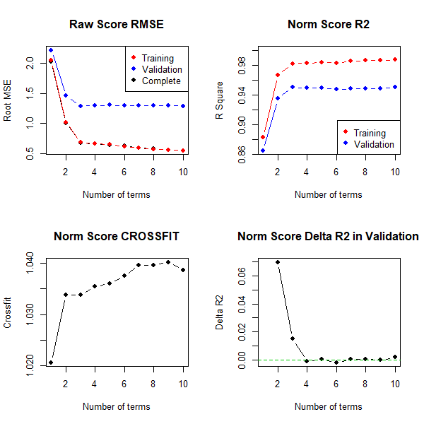

```{r setup, include = FALSE}
knitr::opts_chunk$set(
  collapse = TRUE,
  comment = "#>"
)
```
cNORM is a package for the R environment for statistical computing that aims at generating continuous test norms in psychometrics and biometrics and to analyze the model fit. It is based on the approach of A. Lenhard, Lenhard, Suggate and Segerer (2016).

The method stems from psychometric test construction and was developed to create continuous norms for age or grade in performance assessment (e. g. vocabulary development, A. Lenhard, Lenhard, Segerer & Suggate, 2015; reading and writing development, W. Lenhard, Lenhard & Schneider, 2017). It can however be applied wherever test data like psychological (e. g. intelligence), physiological (e. g. weight) or other measures are dependent on continuous (e.g., age) or discrete (e.g., sex or test mode) explanatory variables.

The package estimates percentile curves in dependence of the explanatory variable (e. g. schooling duration, age ...) via Taylor polynomials, thus offering several advantages:

*   By optimizing the model on the basis of the total sample, small deviations from the representativeness of individual subsamples, for example due to incomplete data stratification, are minimized.
*   Gaps between different discrete levels of the explanatory variable are closed. For example, in school performance tests, norm tables can be created not only for the discrete measurement point of the norm sample collection (e.g. midyear or end of the year), but also at any time of the school year with the desired accuracy.
*   The total sample size for the norm data collection is reduced because all norm tables are determined on the basis of the entire sample.
*   The limits of the model fit can be evaluated graphically and analytically. For example, it is possible to determine where the model deviates strongly from the manifest data or where strong floor or ceiling effects occur. This makes it possible to specify at which points the test scores can no longer be interpreted in a meaningful way.
*   cNORM does not require any distribution assumptions. If floor or ceiling effects occur, the data can therefore often be modeled much more precisely, than with parametric methods. This is particularly true for those areas that deviate relatively strongly from the population average, but often represent precisely those areas that have the highest relevance in diagnostic practice.
    
In the following sections, we demonstrate the necessary steps for the application of the R package with real human performance data, namely, with the standardization sample of the sentence comprehension subtest of ELFE 1-6, a reading comprehension test in German language (W. Lenhard & Schneider, 2006). 

## 1. Data Preparation
If a sufficiently large and representative sample has been established (missings should be excluded), then the data must first be imported. It is advisable to start with a simply structured data object of type data.frame, which only contains numeric variables without value labels. It is as well favorable to label the measured raw scores with the variable name 'raw', as this is the default specification in cNORM. However, all variable names can also be defined individually, but must then be specified as function parameters. The explanatory variable in psychometric performance tests is usually age. We therefore refer to this variable as 'age'. In fact, however, the explanatory variable is not necessarily age. A training or schooling duration or other explanatory variables can also be included in the modeling. However, it must be an interval-scaled (or, as the case may be, dichotomous) variable. Finally, a grouping variable is required to divide the explanatory variable into smaller standardization groups (e.g. grades or age groups). The method is relatively robust against changes in the granularity of the group subdivision. For example, the result of the standardization only marginally depends on whether one chooses half-year or full-year gradations (see A. Lenhard, Lenhard, Suggate & Segerer, 2016). The more the variable to be measured covaries with the explanatory variable (e. g. a fast development over age in an intelligence test), the more groups should be formed beforehand to capture the trajectories adequately. By standard, we assign the variable name "group" to the grouping variable.

### Recoding Continuous Variables
If, when using cNORM, you initially only have the continuous age variable available, you must recode it into a discrete grouping variable. The following code could be helpful (another possibility is the'rankBySlidingWindow' function described below):

```
# Creates a grouping variable for a fictitious age variable
# for children age 2 to 18. That way, the age variable is recoded
# into a discrete group variable, each group comprising a year.

data$group <- c(3, 4, 5, 6, 7, 8, 9, 10, 11, 12, 13, 14, 15, 16, 17, 18)
   [findInterval(data$age, c(-Inf, 3, 4, 5, 6, 7, 8, 9, 10, 11, 12,
   13, 14, 15, 16, 17))]
```


Of course, it is also possible to use a data set for which standard scores already exist for individual age groups. Please pay attention, that the grouping variable corresponds to the group mean in case, you use a continuous age variable later on.

### Sample Data
A continuously distributed age variable is not necessary in this case. For demonstration purposes, cNORM includes a cleaned data set from a German test standardization (ELFE 1-6, W. Lenhard & Schneider, 2006, subtest sentence comprehension) that will be used for demonstrating the method. Another large (but unrepresentative) data set for demonstration purposes stems from the adaption of a vocabulary test to the German language (PPVT-4, A. Lenhard, Lenhard, Segerer & Suggate, 2015). For biometric modeling, it includes a large CDC dataset (N > 45,000) for growth curves from age 2 to 25 (weight, height, BMI; CDC, 2012) and for macro economical and sociological data the data on mortality and life expectancy at birth from 1960 to 2017 from the World Bank. You can retrieve information on the data by typing ?elfe, ?ppvt, ?CDC, ?life or ?mortality on the R console. To load the data sets, please use the following code:

```
# Loads the package cNorm
library(cNORM)

# Copies the data set "elfe" from the environment into the object 'normData'
normData <- elfe

# Or similarly for the "ppvt"
normData <- ppvt

# And finally the data for the Body Mass Index
# Please specify 'bmi' as the 'raw' variable in this case in later analyses
normData <- CDC

# Displays the first lines of the data
head(normData)
```

### Data Exploration
As you can see, there is no age variable in the data set 'elfe', only a person ID, a raw score and a grouping variable. In this case, the grouping variable also serves as a continuous explanatory variable, since children were only examined at the very beginning and in the exact middle of the school year during the test standardization. For example, the value 2.0 means that the children were at the beginning of the second school year, the value 2.5 means that the children were examined in the middle of the second school year. Another possibility would have been to examine children throughout the entire school year. In this case, the duration of schooling would have to be entered as a continuous explanatory variable. To build the grouping variable, the first and second half of each school year could, for example, be aggregated into one group respectively. In the 'elfe' data set there are seven groups with 200 cases each, i.e. a total of 1400 cases. With the help of the psych package, descriptive data can be displayed in groups if desired (optional):

```
# Install psych package
install.packages("psych", dependencies = TRUE)

# Display descriptive results
library(psych)
describeBy(normData, group="group")
```

### Ranking
The next step is to rank each person in each group using the rankByGroup function. The function returns percentiles and also performs a normal-rank transformation in which T-Scores (M = 50, SD = 10) are returned by default. In principle, our mathematical method also works without normal rank transformation, i.e., the method could theoretically also be carried out with the percentiles. This is useful, for example, if you want to enter a variable that deviates extremely from the normal distribution or follows a completely different distribution. For most psychological or physical scales, however, the distributions are still sufficiently similar to the normal distribution even with strong bottom and ceiling effects. In these cases, the normal-rank transformation usually increases the model fit and facilitates the further processing of the data. In addition to T-Scores, the standard scores can also be expressed as z- or IQ-Scores. You can also choose between different ranking methods (RankIt, Blom, van der Warden, Tukey, Levenbach, Filliben, Yu & Huang). However, we want to stick to T-Scores and RankIt, which are preset by default:

```{r}
# Start up cNORM
library(cNORM)
# Determine percentiles by group
normData <- rankByGroup(elfe, group = "group") 
```
To change the ranking method, please specify a method index with method = x (x = method index; see function help). The standard score can be specified as T-Score, IQ-Score, z-Score or by means of a double vector of M and SD, e.g. scale = c(10, 3) for Wechsler subtest scaled scores. The grouping variable can be deactivated by setting group = FALSE. The normal-rank transformation is then applied to the entire sample.

Please note that there is another function for determining the rank, which works without discrete grouping variables. The rank of each individual subject is then estimated based on the continuous explanatory variables using a sliding window. The width of this window can be specified individually. In the case of a continuous age variable, the specification width = 0.5 means, for example, that the width of the window is half a year. As a consequence, the rank of a test persons is based on all participants who are no more than 3 months younger or older than the test person in question, i. e., the group comprises a total of 6 months.

```
# Percentile generation by a sliding window of the size 'width'
normData2 <- rankBySlidingWindow(data = elfe, age = "group", raw = "raw", width = 0.5)
```

Please note that the 'rankBySlidingWindow' function only makes sense if the age variable is actually continuous. In the 'elfe' data set the variable 'group' serves as continuous explanatory variable as well as discrete grouping variable. Therefore, with the function 'rankBySlidingWindow' we obtain the same standard scores as with the function 'rankByGroup' in this specific case.

Both ranking functions ('rankBySlidingWindow' and'rankByGroup') add two additional columns, namely 'percentile' and 'normValue'. In addition, descriptive information about each group is added, namely n, m, md and sd. Descriptive results are only necessary under certain circumstances. The creation of these variables can be deactivated via the parameter 'descriptives'.


### Computing powers and interactions

At this point, where many test developers already stop standardization, the actual modeling process begins. A function is determined which expresses the raw score as a function of the latent person parameter l and the explanatory variable. In the following, we will refer to the latter variable as 'a'. In the 'elfe' example, we use the discrete variable 'group' for a. If there is an additional continuous age variable, it should be used instead as 'a' because of its higher precision.

To retrieve the mathematical model, all powers of the variables 'l' and 'a' up to a certain exponent k must be computed. Subsequently, all interactions between these powers must also be calculated by simple multiplication. As a rule of thumb, k > 5 leads to over-adjustment. In general, k = 4 or even k = 3 will already be sufficient to model human performance data with adequate precision. Please use the following function for the calculation:

```{r}
# Calculation of powers and interactions up to k = 4
normData <- computePowers(normData, k = 4, norm = "normValue", age = "group") 
```
The data set now has 24 new variables ( $2*k + k^{2}$ ), namely `L1`, `L2`, `L3`, `L4` (powers of the norm value), `A1`, `A2`, `A3`, `A4` (powers of the grouping variable) and the linear combinations `L1A1`, `L2A1` ... `L4A3`, `L4A4`. 


## 2. Modeling
We now want to find a regression model that models the original data as closely as possible with as few predictors as possible. We however want to smooth out noise from the original norm data, which can be due to the random sampling process or violations of representativeness. This is done through the 'bestModel' function. You can use this function in two different ways: If you specify $R_{adjusted}^{2}$, then the regression function will be selected that meets this requirement with the smallest number of predictors. You can however also specify a fixed number of predictors. Then the model is selected that achieves the highest $R_{adjusted}^{2}$ with this specification. To select the best model, cNORM uses the 'regsubset' function from the 'leaps' package. As we do not know beforehand, how well the data can be modeled, we start with the default values (k = 4 and $R_{adjusted}^{2}$ = .99):


```{r}
model <- bestModel(normData)
```

Fine! The determined model already exceeds the predefined threshold of $R_{adjusted}^{2}$ = .99 with only three predictors (plus intercept). The 'bestModel' function as well returns the coefficients and the complete regression formula, which - as was specified - captures more than 99% of the variance in the data set.

If you want to have a look at the selection procedure, all the information is available in 'model$subsets'. The variable selection process per step is listed in 'outmat' and 'which'. There, you can find the $R^{2}$, $R_{adjusted}^{2}$, $C_p$ and $BIC$: 


```{r}
printSubset(model)
```

Furthermore, information about the change of Radjusted and other information criteria (Mallow's Cp or BIC) depending on the number of predictors (with fixed k) can also be graphically inspected. Please use the following command to do this:

```{r fig1, fig.height = 4, fig.width = 7}

plotSubset(model, type = 0) 
```

The figure displays Radjusted2 as a function of the number of predictors by default. Alternatively, you can also plot log-transformed Mallow's $C_p$ (type = 1) and $BIC$ (type = 2) as a function of $R_{adjusted}^{2}$ or RMSE (type = 3) as a function of the number of terms.

```{r fig2, fig.height = 4, fig.width = 7}
plotSubset(model, type = 1) 
``` 

The figure shows that the default value of $R_{adjusted}^{2}$ = .99 is already achieved with only three predictors. The inclusion of further predictors only leads to small increases of Radjusted or to small decreases of Mallow's $C_p$. Where the dots are close together, the inclusion of further predictors is of little use. To avoid over-fitting, a model with as few predictors as possible should therefore be selected from this area.

The model with three predictors seems to be suitable. Nevertheless, the model found in this way must still be tested for plausibility using the means described in Model Validation. Above all, it is necessary to determine the limits of model validity. If a model turns out to be suboptimal after this model check, $R_{adjusted}^{2}$, the number of predictors or, if necessary, k should be chosen differently. What is more, you can use the cnorm.cv cross validation function to get an impression on the quality of the norm sample and modeling process. The function determines RMSE for the raw score of the training and validation data (80% and 20% drawn from the data set), $R^{2}$ for the norm scores, crossfit and norm score $R^{2}$. Crossfit values below indicate an underfit and values greater 1 an overfit, with values between .9 and 1.1 being optimal:

```
# use the original elfe data
d <- prepareData(elfe)

# do a cross validation with 2 repetitions, restrict number of max terms to 10
cnorm.cv(d, max=10, repetitions = 2)
```


In this specific case, it might not be worthwhile to use more terms than 4, because $R^{2}$ in the cross validated data set does not increase anymore.You should however as well inspect to percentile curves visually or use the 'checkConsistency' function on the final model to avoid intersecting percentile curves and use a model with more terms in that case.


## 3. Model Validation

From a mathematical point of view, the regression function represents a so-called hyperplane in three-dimensional space. If $R^2$ is sufficiently high (e.g. $R^2 > .99$), this plane usually models the manifest data over wide ranges of the standardization sample very well. However, a Taylor polynomial, as used here, usually has a finite radius of convergence. This means that there are age or performance ranges for which the regression function no longer provides plausible values. With high R2, these limits of model validity are only reached at the outer edges of the age or performance range of the standardization sample or even beyond. Please note that such model limits occur not only because the method is not omnipotent, but also because the underlying test scales have only a limited validity range within which they can reliably map a latent ability to a meaningful numerical test score. In other words, the limits of model validity often show up at those points where the test has too strong floor or ceiling effects or where the standardization sample is too diluted.

Of course, norm tables and normal scores should generally only be issued within the validity range of the model and the test. It is therefore essential to determine the limits of model validity when applying cNORM (or any other procedure used to model normal scores). For this purpose, cNORM mainly provides graphical methods, which we present to you on this page. At this point, however, we would like to point out to the mathematically experienced users that it is also possible to approach the topic analytically. Since the regression equation is a polynomial of the nth degree that is very easy to handle from a mathematical point of view, it can be subjected to a conventional curve sketching. This makes it very easy to determine, for example, where extremes, turning points, saddle points, etc. occur or where the gradient has implausible values.

Below you will find three functions for checking the model fit graphically and making the limits of the model visible:

### plotPercentiles
The following figure shows how well the model generally fits the manifest data:

```{r fig3, fig.height = 4, fig.width = 7}
# Plots the fitted and the manifest percentiles

plot <- plotPercentiles(normData, model)

```

In the figure, the range of raw scores was automatically determined by the values in the original dataset, but it can be manually specified by 'minRaw = 0' and 'maxRaw = 28' (range of scores in this particular test) as well. As the figure shows, the predicted percentiles run smoothly across all levels of the explanatory variable and are in good agreement with the original data. Small fluctuations between the individual groups are eliminated. It is important to ensure that the percentile lines do not intersect, since this would mean that different values of the latent person variable are assigned to one single raw score. The mapping of latent person variables to raw scores would no longer be biunique (=bijective) at this point, e.g. it would not be possible to distinguish between these different values of the latent variable by means of the test score. As already described above, intersecting percentiles predominantly occur when the regression model is extended to age or performance ranges that do not or only rarely occur in the standardization sample, or when the test shows strong floor or ceiling effects.

If you are not sure yet, which model to choose, you can display a series of plots via the plotPercentileSeries function with an increasing number of predictors, for example:

```
# Displays a series of plots of the fitted and the manifest percentiles
plotPercentileSeries(normData, model)
```

### plotRaw
In the next figure, the fitted and the manifest data are compared separately for each (age) group:
```{r fig4, fig.height = 4, fig.width = 7}
plotRaw(normData, model, group="group")
```

The adjustment is particularly good if all points are as close as possible to the bisecting line. However, it must be noted that deviations in the extremely upper, but particularly in the extremely lower performance range often occur because the manifest data in these areas are also associated with low reliability.

### plotNorm
This function does the same as plotRaw, but instead uses norm values. Please note, that it might take some time depending on the sample size:
```
plotNorm(normData, model, group="group", minNorm = 25, maxNorm = 75)
```
### plotDerivative
To check whether the mapping between latent person variables and test scores is biunique, the regression function can be searched numerically within each group for bijectivity violations using the 'checkConsistency' function. In addition, it is also possible to plot the first partial derivative of the regression function to l and search for negative values. This can be done in the following way:

```{r fig5, fig.height = 4, fig.width = 7}
plotDerivative(model, minAge=1, maxAge=6, minNorm=20, maxNorm=80)
```

In this figure, we have extended both the age and the performance range beyond the limits of the standardization sample in order to better represent and check the limits of the model validity. (Please remember that the age variable in this norming sample comprises the values 2 to 5 and that 200 children per age group were examined.) As you can see, the first partial derivative of the regression function to l is only negative in the upper age and performance range. This does not mean that the modeling has failed, but that the test scale loses its ability to differentiate in this measuring range.

When, at the end of the modeling process, norm tables are generated, the identified limits of model validity must be respected. Or to put it in other words: Normal scores should only be issued for the valid ranges of the model.


## 4. Generating Norm Tables
In addition to the pure modeling functions, cNORM also contains functions for generating norm tables, retrieving the normal score for a specific raw score and vice versa or for the visualization of norm curves. These functions are described below.

### getNormCurve
The first function 'getNormCurve' returns the fitted raw scores for a certain normal score (e.g., T = 50) across different age groups. The parameter 'step' specifies the distance between two age groups. If no further specifications are made, the output is limited to actually occurring raw values and age groups.
```
getNormCurve(50, model, minAge = 2, maxAge = 5, step = 0.25, minRaw = 0, maxRaw = 28)
```

### plotNormCurves
The 'plotNormCurves' function plots the fitted raw scores for pre-specified normal scores (e.g., T = 30, 40, 50, 60, 70) across age.
```{r fig6, fig.height = 4, fig.width = 7}
plotNormCurves(model, normList = c(30, 40, 50, 60, 70), minAge = 2, maxAge = 5, step = 0.1, minRaw = 0, maxRaw = 28)
```

### predictNorm
The 'predictNorm' function returns the normal score for a specific raw score (e.g., raw = 15) and a specific age (e.g., a = 4.7). The normal scores can be limited to a minimum and maximum value in order to take into account the limits of model validity.
```{r}
predictNorm(15, 4.7, model, minNorm = 25, maxNorm = 75)
```

### predictRaw

The 'predictRaw' function returns the predicted raw score for a specific normal score (e.g., T = 55) and a specific age (e.g., a = 4.5).
```{r}
predictRaw(55, 4.5, model$coefficients, minRaw = 0, maxRaw = 28)
```

### normTable

The 'normTable' function returns the corresponding raw scores for a specific age (e.g., a = 3) or vector of ages and a pre-specified series of normal scores. The parameter 'step' specifies the distance between two normal scores.
```
# Generate norm table for grade 3
normTable(3, model, minRaw = 0, maxRaw = 28, minNorm=30, maxNorm=70, step = 1)

# You as well can generate multiple tables at once, by providing a vector for the age groups,
# here for grade 3, 3.5, 4 and 4.5
normTables -> normTable(c(3.5, 4.5), model, minRaw = 0, maxRaw = 28, 
              minNorm=30, maxNorm=70, step = 1)

# In case, you want to use the data for producing paper and pencil tests, you might
# want to export the data. Here, this is demonstratet with an export to Excel:
# Install psych package
install.packages("openxlsx", dependencies = TRUE)
library(xlsx)
write.xlsx(normTables, file="normtables.xlsx")

```

Norm tables, in which the raw score or the range of raw scores is given for a certain normal score, are usually needed if one has several test scales, all of which are to be converted into the same type of normal scale. Please note that as a test designer you cannot use this function directly to generate norm tables. Instead you have to convert the table to a suitable form first. Remember that raw scores are usually integers. Therefore, the normal score series should not start at an integer value, but e.g. at 30.5. If a step size of 1 is selected, normal score intervals with integers as interval centers are generated. In the example shown, the T-score interval [30.5; 31.5] contains only one single integer raw score, namely 4, which would therefore be assigned to the T-score 31. A whole range of raw scores (or no raw score at all) can thus be assigned to a particular integer normal score.

### rawTable
The function 'rawTable' is similar to 'normTable', but reverses the assignment: The normal scores are assigned to a pre-specified series of raw scores at a certain age. This requires an inversion of the regression function, which is determined numerically.
```
# Generate raw table for grade 3.5
rawTable(3.5, model, minRaw = 0, maxRaw = 28, minNorm = 25, maxNorm = 75, step = 1)

# Generate raw table for grade 3.5, 3.6, 3.7
rawTable(c(3.5, 3.6, 3.7), model, minRaw = 0, maxRaw = 28, minNorm = 25, maxNorm = 75, step = 1)
```
You need these kind of tables if you want to determine the exact percentile or the exact normal score for all occurring raw scores. With higher precision and smaller increments, this function becomes computationally intensive.


## Examples
Please visit https://www.psychometrica.de/cNorm_examples_en.html for further examples with the inbuilt data sets, especially with respect to continuous explanatory variables and non standard application cases.


## References
*   CDC (2012). National Health and Nutrition Examination Survey: Questionaires, Datasets and Related Documentation. available: https://wwwn.cdc.gov/nchs/nhanes/OtherNhanesData.aspx. date of retrieval: 25/08/2018
*   Lenhard, A., Lenhard, W., Segerer, R. & Suggate, S. (2015). Peabody Picture Vocabulary Test - Revision IV (Deutsche Adaption). Frankfurt a. M.: Pearson Assessment.
*   Lenhard, A., Lenhard, W., Suggate, S. & Segerer, R. (2016). A continuous solution to the norming problem. Assessment, Online first, 1-14. doi: 10.1177/1073191116656437
*   Lenhard, W., Lenhard, A. & Schneider, W. (2017). ELFE II - Ein Leseverstaendnistest für Erst- bis Siebtklaessler. Goettingen: Hogrefe.
*   Lenhard, W. & Schneider, W. (2006). ELFE 1-6 - Ein Leseverstaendnistest für Erst- bis Sechstklässler. Goettingen: Hogrefe.
*   The World Bank (2018). Mortality rate, infant (per 1,000 live births). Data Source available https://data.worldbank.org/indicator/SP.DYN.IMRT.IN (date of retrieval: 02/09/2018)
*   The World Bank (2018). Life expectancy at birth, total (years). Data Source World Development Indicators available https://data.worldbank.org/indicator/sp.dyn.le00.in (date of retrieval: 01/09/2018)
