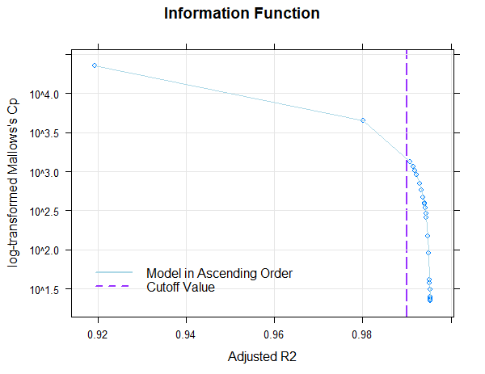

```{r setup, include = FALSE}
knitr::opts_chunk$set(
  collapse = TRUE,
  comment = "#>"
)
```
cNORM is based on the non-parametric continuous norming approach described by Lenhard et al. (2016). It originates from the construction of psychometric tests, but can be used to model physiologic data and comparable scenarios as well. It models percentile curves in dependence of age or another explanatory variable and has the following advantages:

*   By drawing on the data of the complete sample, errors in representativeness or stratification of single norm samples are smoothed.
*   Gaps between different norm samples are closed and gaps within norm tables as well do not occur anymore. For example, when constructing tests for grades, norm tables for any point in time in the school year can be retrieved with the desired precision.
*   The overall sample size for test construction is reduced, because all norm tables are established via the complete sample.
*   To some degree, horizontal (beyond the age range of the norm sample) and vertical extrapolation (norm values at the upper and lower end) can be calculated, but have to be evaluated cautiously 

This vignette demonstrates the different steps on the bases of the raw data from the ELFE 1-6 reading comprehension test (sentence completion task). It essentially comprises four steps:

1.  Data preparation
1.  Modeling
1.  Validation of the model
1.  Plotting the results and the norm tables

## 1. Data preparation
In the first step, please read in your data. It is advisable, to start with a simply structured data.frame with the pure and unlabeled numeric vectors `raw` with the raw values, the age or grade variable, e. g. named `age` and the grouping variable, e. g. named `group`. In case, you start only with the continuous age variable, you have to calculate a grouping variable with the distinct groups. The following code might help you:

```
# Build a grouping variable from a fictitious age variable into a grouping variable.
# Here, age is recoded into a grouping variable spanning a whole year, each. 
data$group <- c(2, 3, 4, 5, 6, 7, 8, 9, 10, 11, 12, 13, 14, 15, 16, 17, 18)
        [findInterval(data$age, c(-Inf, 2, 3, 4, 5, 6, 7, 8, 9, 10, 11, 12,
        13, 14, 15, 16, 17))]
```


Of course, you can use a dataset that already has a variable on norm values per group. For demonstration purposes, cNORM already includes a clean example data set, drawn from a test norming project (ELFE 1-6 Sentence Completion task, Lenhard & Schneider, 2006), which we will use in the following. There is another large sample from the PPVT4 norming project (German adaption) that is based on chronological age and includes demografic data like sex, school form, migration background and language spoken at home as well. Please type `?elfe` and `?ppvt` to display information on both data sets. To load the ELFE 1-6 or PPVT4 data into your global environment, please type: 
```
# load package
library(cNORM)

# copy data frame to global environment
normData <- elfe

# use PPVT4 instead
normData <- ppvt

# convenient method to already apply the data preparation (to skip ranking and computing powers)
normData <- prepareData(normData)

# Show the first rows of the data.frame
head(normData)
```
As you can see, the data.frame initially consists of those three variables, namely an ID of the person, the grouping variable (grade of the student with .0 indicating the beginning and .5 indicating the midst of the school year) and the raw data. Each age group includes 200 cases, 1400 cases in total. To get an overview on the different groups, the psych package helps to retrieve descriptive data by group (optional):

```
library(psych)
describeBy(normData, group="group")
```
The next step is, to retrieve the norm data per group via the `rankByGroup`-function. The function retrieves the percentiles and is doing a normal rank transformation to assign T values as well. Essentially, the analyses can as well be done with the percentiles as well and normal rank transformations are problematic, when the data deviates from a normal distribution considerably. Additionally, it is possible, to retrieve z or IQ values and the ranking procedure can be chosen as well (default: RankIt, Blom, van der Warden, Tukey, Levenbach, Filliben, Yu & Huang). First, we want to stick with T values and RankIt, which are already the predefined values:

```
normData <- rankByGroup(elfe, group = "group")
```
To change the ranking method, please specify `method=x` (x = method index; consult function help for details). The parameter for the norm scale calculation can be either `T`, `IQ`, `z` or a double vector with mean and sd, as f. e. `scale = c(10, 3)` for Wechsler like tests. It is possible to deactivate the grouping bei setting `group = FALSE`, which applies the normal rank transformation to the complete sample, independent from age group. Please note, that there is another option to retrieve norm values independet from groups on the basis of a contiuous age variable by a sliding window approach. Each individual gets an individual value based on the collection of cases within the range of the width parameter:

```
# Percentile generation by a sliding window of the size 'width'
normData2 <- rankBySlidingWindow(data = elfe, age = "group", raw = "raw", width = 0.5)
```

The function 'rankBySlidingWindow' would however only make sense, if the age variable is truely contiuous, whereas in the sample data it is already grouped. With the sample dataset, we get exactly the same values that way. The data.frame now has two additional columns: percentile and normValue and usually. In case of the sliding window, there is another column 'n' indicating the number of cases, the norm value was based upon.

In test development, many researchers stop here, but now our modelling process starts. The normValue specifies the location (`L`) within the norm sample and the variable group will be our explanatory variable (`A`) in the following analyses. We finally build the powers of `A` and `L` up to the factor `k` and their interactions, simply by building all linear combinations through multiplication. As a rule of thumb, `k = 4` is usually sufficient to model human performance data. Please use the following function for the computation: 

```
normData <- computePowers(normData, k = 4, normVariable = "normValue", explanatoryVariable = "group")
```
The data set now has 24 new variables ( $2*k + k^{2}$ ), namely `L1`, `L2`, `L3`, `L4` (powers of the norm value), `A1`, `A2`, `A3`, `A4` (powers of the grouping variable) and the linear combinations `L1A1`, `L2A1` ... `L4A3`, `L4A4`. For the explanatory variable you can either specify the grouping variable or - if present - the original continuous age variable, which leads to a higher precision.

## 2. Modeling
We now want to find a regression model that models the original data as closely as possible with as few predictors as possible. We however want to smooth out noise from the original norm data, which can be due to small violations of representativeness. The `bestModel` function does this and either chooses the model, which exceeds a predefined $R_{adjusted}^{2}$ value or has fixed number of predictors. cNORM uses the `regsubset` function from the `leaps` package for this. As we do not know beforehand, how well the data can be modeled, let us stick to the default values (up to power $k = 4$ and $R^{2} = .99$):

```
model <- bestModel(normData)
```

The function prints the following result:
```
Final solution: 3
R-Square Adj. amounts to 0.990812753080448
Final regression model: raw ~ L3 + L1A1 + L3A3
Beta weights are accessible via 'model$coefficients':
  (Intercept)            L3          L1A1          L3A3 
-1.141915e+01  2.085614e-05  1.651765e-01 -5.911150e-07 

Regression formula:
[1] "raw ~ -11.4191452286606 + (2.08561440071111e-05*L3) + (0.165176532450589*L1A1) + (-5.9111502682762e-07*L3A3)"

Use 'plotSubset(model)' to inspect model fit
```
Fine! We already reached the threshold with a regression formula with three predictors (+ intercept). The coefficients and the complete formula are in the output as well. The regression formula precisely captures most of the variance in the data set. In order to further assess the quality of this solution, we now check if the model is coherent and if the percentiles are plausible. We thus progress to Step 3. In case, a model turns out to be suboptimal, please repeat step 2 with adjusted parameters until you find a suiting model.

If you want to have a look at the selection procedure, all the information is available in `model$subsets`. The variable selection process per step is listed in `outmat` and `which`. There, you can find the $R^{2}$, $R_{adjusted}^{2}$, $C_p$ and $BIC$  as well. The regression coefficients for the selected model are available through `model$coefficients`, as well as the fitted values (`model$fitted.values') and all other information. How well the original values are predicted by the regression model can be shown with

```
plotValues(normData, model, group="group")
```


## 3. Validation of the model
We inspect the model both visually and numerically and first, we check, if $R_{adjusted}^{2}$ was a good choice. For this, we plot $R_{adjusted}^{2}$ against information criteria (either Mallow's $C_p$, an $AIC$ like measure, or $BIC$):
```
plotSubset(model)
```



In the plot, per default, Mallow's $C_p$ is used (or more precisely $\log{C_p}$), an AIC like measure ($BIC$ is available through the option `bic = TRUE`). The predefined $R_{adjusted}^{2}$ value of .99 is already reached with the third model and afterwards we only get minor improvements in $R_{adjusted}^{2}$. On the other hand, $C_p$ rapidly declines afterwards, so model 3 seems to be a good candidate in terms of the relative information content per predictor and the captured information ($R_{adjusted}^{2}$). It is advisable to choose a model at the "elbow" in order to avoid over-fitting, but the solution should be tested for violations of model assumptions and the progression of the percentiles should be inspected visually, as well. In case, original and fitted values deviate too much, choose a higher $R_{adjusted}^{2}$ and / or a higher k. For the visual inspection, we can use the `plotPercentiles` function, which displays the predicted progression over age as lines and the manifest data as dots:

```
# Plot the predicted and the original norm values
plotPercentiles(normData, model)
```


As you can see from the plot, the predicted lines are smooth and capture the original data pretty well, while eliminating random variation from age group to age group. Importantly, the percentile lines do not intersect, which would be a violation of the model assumptions: Within each age group, the mapping of norm values and raw values has to be one to one, or to use a mathematical expression, the function has to be bijective. A violation  however usually only occurs when extrapolating horizontally (= stretching the norm tables to an age that is not included in the norm sample) or vertically (= using extreme norm values with $T < 20$ or $T > 80$). To check the range, where the model assumptions are valid, we can numerically cycle through the norm groups and look out for decreasing raw values with increasing norm value (function `checkConsistency`), or to determine the first order derivation of the regression function $\frac{\delta f(l, a)}{\delta(l)}$ and search for negative slopes. This can be done via 

```
plotDerivative(model, minAge=1, maxAge=6, minNorm=20, maxNorm=80)
```

Here, both, a horizontal and vertical extrapolation was done in order to intentionally violate the model. The age (in this case, the grade) spans below grade 2 and above grade 5, that is outside the original norm study. While at the lower end of the age, the model assumptions hold true, especially above grade 5 and with T values above 70, the model does not work anymore:


It has to be noted, though, that to some degree, minor violation are to be expected, namely in the case of bottom and ceiling effects. When finally compiling norm tables, minor irregularities in the tables should be corrected by hand. 

## 4. Plotting the results and the norm tables
With `plotPercentiles`, already a comprehensive display of the norm curve trajectories is at hand. There are however other functions, that help to get an overview over the percentiles, to produce norm tables or to directly predict the norm value for an acquired raw value. These functions are described briefly:

*   **plotNormCurves**
```
plotNormCurves(model, normList = c(30, 40, 50, 60, 70),
                           minAge = 2,
                           maxAge = 5,
                           step = 0.1,
                           minRaw = 0,
                           maxRaw = 1000)
```
The function plots the norm curves based on the regression model. Please check the function for inconsistent curves: The different curves should not intersect. You can specify the age range, range of raw values and the list of norm curves in the plot.

*   **getNormCurve**
```
getNormCurve(normValue, model, minAge = 2, maxAge = 5, step = 0.1,
                         minRaw = 0, maxRaw = 1000)
```
Here, you can compile the course of a percentile over age, thus showing the cross sectional development of a variable.

*   **predictRaw**
```
predictRaw(normValue, age, coefficients, min = 0, max = 1000)
```
The raw value for an specific norm value and age is determined.

*   **predictNormValue**
```
predictNormValue(raw, A, model, min = 25, max = 75, precision = 0.1)
```
The norm value for an specific raw value and age is determined.

*   **normTable**
```
normTable(A, model, min = 25, max = 75, step = 0.1, descend = FALSE)
```
This function combines the functionality of the preceding smaller functions in order to generate a norm table for a specific age with the desired degree of granularity and a predefined range of norm values. As a test constructor, you would finally take this table and manually bring it to a form, that can be printed in the manual of a psychometric or medical test. If you are working on computer based testing, you can of course directly take the model to retrieve values on the fly or use this package in a server environment and have it do it for you.

*   **rawTable**
```
rawTable(A, model, min, max, minNorm = 25, maxNorm = 75, step = 1, precision = .1, descend = FALSE)
```
This function is comparable to 'normTable', despite it reverses the assignment:
A table with raw values and the according norm values for a specific age based on the regression
model is generated. This way, the inverse function of the regression model is solved numerically with
brute force. Please specify the range of raw values, you want to cover. With higher precision
and smaller stepping, this function becomes computational intensive.


## Final conclusion
We started on working on this methodology while adapting the vocabulary test PPVT-IV to the German language (A. Lenhard, Lenhard, Suggate & Segerer, 2015). Alexandra had the idea to use a very robust and well-known methodology from physics (e. g. for doing spectral analyses) and apply it to human performance data. Therefore, Taylor polynomials came into play and they turned out to produce very robust solutions, when used with $Location$, $Age$ and ${Location}\times{Age}$. So far, we have applied it in the construction of the PPVT-IV (A. Lenhard et al., 2015), ELFE II (W. Lenhard, Lenhard & Schneider, 2017) and in reanalyses of other tests like ELFE 1-6. In case, you find this walk-through helpful or used cNORM in your own test construction, we would thank you for leaving us a note. If you are interested in the theoretical background of this approach, please have a look at A. Lenhard, Lenhard, Suggate and Segerer (2016), which you can find via <http://go.uniwue.de/cn>.


## References
*   Lenhard, A., Lenhard, W., Segerer, R. & Suggate, S. (2015). Peabody Picture Vocabulary Test - Revision IV (Deutsche Adaption). Frankfurt a. M.: Pearson Assessment.
*   Lenhard, A., Lenhard, W., Suggate, S. & Segerer, R. (2016). A continuous solution to the norming problem. Assessment, Online first , 1-14. doi: 10.1177/1073191116656437
*   Lenhard, W., Lenhard, A. & Schneider, W. (2017). ELFE II - Ein Leseverständnistest für Erst- bis Siebtklässler. Göttingen: Hogrefe.
*   Lenhard, W. & Schneider, W. (2006). ELFE 1-6 - Ein Leseverständnistest für Erst- bis Sechstklässler. Göttingen: Hogrefe.
*   Lenhard, W., Schroeders, U., & Lenhard, A. (2017). Equivalence of Screen Versus Print Reading Comprehension Depends on Task Complexity and Proficiency. Discourse Processes, 1–19. doi: 10.1080/0163853X.2017.1319653


