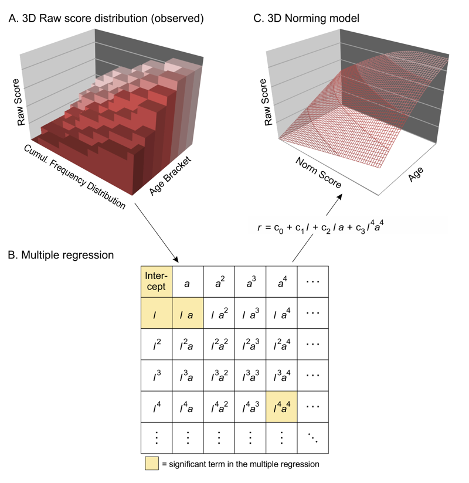

```{r setup, include = FALSE}
knitr::opts_chunk$set(
  collapse = TRUE,
  comment = "#>"
)
library(cNORM)
library(ggplot2)

```

cNORM is a package for the R environment for statistical computing that aims at generating continuous test norms in psychometrics and biometrics and to analyze the model fit. It is based on the approach of A. Lenhard et al. (2016, 2019), which aims at fitting Taylor polynomials. It as well includes the option for parametric modelling data with beta binomial distributions. In this vignette, however, we will focus on the Taylor polynomial approach for continuous norming. Please consult the vignette 'BetaBinomial' for the parametric norming.

The method stems from psychometric test construction and was developed to create continuous norms for age or grade in performance assessment (e. g. vocabulary development, A. Lenhard, Lenhard, Segerer & Suggate, 2015; reading and writing development, W. Lenhard, Lenhard & Schneider, 2017). It can however be applied wherever test data like psychological (e. g. intelligence), physiological (e. g. weight) or other measures are dependent on continuous (e.g., age) or discrete (e.g., sex or test mode) explanatory variables. It has been applied to biometric data (fetal growth in dependence of gestation week) and macro economic data as well. It does not require any assumptions on the data distribution.

The package estimates percentile curves in dependence of the explanatory variable (e. g. schooling duration, age ...) via Taylor polynomials, thus offering several advantages, some of which apply to all continuous norming approaches:

*   By optimizing the model on the basis of the total sample, small deviations from the representativeness of individual subsamples, for example due to incomplete data stratification, are minimized. Further, it can automatically post-stratify samples to approximate representativeness.
*   Gaps between different discrete levels of the explanatory variable are closed. For example, in school performance tests, norm tables can be created not only for the discrete measurement point of the norm sample collection (e.g. midyear or end of the year), but also at any time of the school year with the desired accuracy.
*   The total sample size for the norm data collection is reduced because all norm tables are determined on the basis of the entire sample.
*   The limits of the model fit can be evaluated graphically and analytically. For example, it is possible to determine where the model deviates strongly from the manifest data or where strong floor or ceiling effects occur. This makes it possible to specify at which points the test scores can no longer be interpreted in a meaningful way.
*   The modelling with Taylor polynomials does not require any distribution assumptions.
*   For post-stratification of non-representative samples, cNORM draws on iterative proportional fitting (raking) to approximate representativeness. Please consult the 'WeightedRegression' vignette for further information.

The rationale of the approach is to rank the results in the different age cohorts (= age, $a$; a sliding window can be used in case the data is distributed over a large age interval) and thus to determine the observed norm scores (= location, $l$). Afterwards, powers of the age specific location and of the age are computed, as well as all linear interactions. Thus, we model the raw score $r$ as a function of the powers of location $l$ and age $a$ and their interactions by a Taylor polynomial:
$$f(r) = \sum_{k=0}^K \sum_{t=0}^T \beta_{k,t} \cdot l^k \cdot a^t$$

Where:

- $f(r)$ is the function of the raw score $r$
- $\beta_{k,t}$ is the coefficient for the k-th power of location and t-th power of age
- $K$ is the maximum power for location
- $T$ is the maximum power for age


Finally, the data is fitted by a hyperplane via multiple regression and the most relevant terms are identified:




## In a nutshell: Establishing continuous norming models
The 'cnorm' method combines most of the steps in one go. The example in a nutshell already suffices for establishing norm scores. It conducts the ranking, the computation of powers and the modeling. A detailed explanation of the distinct steps follows afterwards. 
 
```
library(cNORM)

# We will use the internal dataset elfe on reading comprehension
# that includes raw scores and grade as a grouping variable.

# Most easy example: conventional norming without age or group.
# Just get the manifest norm scores and as well modelled via polynomial regression.
model <- cnorm(raw = elfe$raw)

# The method 'cnorm' prepares the data and establishes a model for continuous
# norming. Please specify a raw score and a grouping vector.
model <- cnorm(raw = elfe$raw, group = elfe$group)

# Fine tune model selection by checking model fit and by
# visual inspection, e. g. with the following checks
plot(model, "series", start=4, end = 8)   # series of percentile plots
plot(model, "subset")                     # plot information function
cnorm.cv(model$data)                      # run repeated cross validation

# Select final model
model <- cnorm(raw = elfe$raw, group = elfe$group, terms = 3)

# generate norm score table with 90% confiden interval and
# a reliability of .94 for several grade levels
normTable(c(3, 3.2, 3.4, 3.6), model, CI = .9, reliability = .94)

# To set powers of age and location independently, please specify k as the
# power parameter for location and t for age, e. g. for a cubic age trend
# with the ppvt demo data:
model.ppvt <- cnorm(raw = ppvt$raw, group = ppvt$group, k = 4, t = 3)

```

In the following, the single steps in detail:

## 1. Data Preparation and modelling
If a sufficiently large and representative sample has been established (missings will be excluded casewise), then the data must first be imported. It is advisable to start with a simply structured data object of type data.frame or numeric vectors containing raw score and grouping or the continuous explanatory variable. This explanatory variable in psychometric performance tests is usually age. We therefore refer to this variable as 'age' in the following. In fact, however, the explanatory variable is not necessarily age, but can be any continuous variable that exert influence on the raw score. Consequently training or schooling duration or other explanatory variables can also be included in the modeling. However, it must be an interval-scaled (or, as the case may be, dichotomous) variable. The method is relatively robust against changes in the granularity of the group subdivision. For example, the result of the standardization only marginally depends on whether one chooses half-year or full-year gradations (see A. Lenhard, Lenhard, Suggate & Segerer, 2016). The more the variable to be measured co-varies with the explanatory variable (e. g. a fast development over age in an intelligence test), the more groups should be formed beforehand to capture the trajectories adequately. By standard, we assign the variable name "group" to the grouping variable.

### Conventional norming
In case, you are not interested in continuously modelling norm scores over age, cNORM can be used for conventional norming as well. It returns the manifest norm scores and percentiles but as well establishes a polynomial regression model that closes all the missings in the norm table, smoothes error variance and can be used for cautiously extrapolating more extreme raw scores.

```
# Apply conventional norming. You simply have to provide a raw score vector.
# Additionally, you can specify ranking order (parameter 'descend'), the 
# degree of the polynomial (parameter 'k') or the number of terms in the model
# via the parameter 'terms'.

model <- cnorm(raw=elfe$raw, terms=4)
rawTable <- rawTable(0, model)
normTable <- normTable(0, model)
```


### Recoding Continuous Variables
If a continuous variable like age  available, it can either be split into age groups or be used in its continuous form. In that case, an interval width is necessary. To obtain age groups, cNORM includes des helper function 'getGroups':

```
# Creates a grouping variable for a fictitious age variable
# for children age 2 to 18 for the ppvt demo dataset. That way, 
# the age variable is recoded into a discrete group variable 
# with 12 distinct groups. The resulting vector specifies the 
# mean age of each group.

data <- data.frame(age = ppvt$age, raw = ppvt$raw)
data$group <- getGroups(ppvt$age, 12)
```

Of course, it is also possible to use a data set for which values already exist for individual age groups. Please pay attention, that the grouping variable corresponds to the group mean in case, you use a continuous age variable later on.

### Sample Data
For demonstration purposes, cNORM includes a cleaned data set from a German test standardization (ELFE 1-6, W. Lenhard & Schneider, 2006, subtest sentence comprehension) that will be used for demonstrating the method. Another large (but unrepresentative) data set for demonstration purposes stems from the adaption of a vocabulary test to the German language (PPVT-4, A. Lenhard, Lenhard, Segerer & Suggate, 2015). For biometric modeling, it includes a large CDC dataset (N > 45,000) for growth curves from age 2 to 25 (weight, height, BMI; CDC, 2012). You can retrieve information on the data by typing ?elfe, ?ppvt and ?CDC on the R console.

```{r}
library(cNORM)
# Displays the first lines of the data of the example dataset 'elfe'
head(elfe)
```

### Data Exploration
As you can see, there is no age variable in the data set 'elfe', only a person ID, a raw score and a grouping variable. In this case, the grouping variable also serves as a continuous explanatory variable, since children were only examined at the very beginning and in the exact middle of the school year during the test standardization. For example, the value 2.0 means that the children were at the beginning of the second school year, the value 2.5 means that the children were examined in the middle of the second school year. In the 'elfe' data set there are seven groups with 200 cases each, i.e. a total of 1400 cases. 

```{r}
# Display some descriptive results by group
by(elfe$raw, elfe$group, summary)
```

### Data Preparation and modelling
The complete process is captured by the 'cnorm' function. Internally, 'cnorm' first ranks the raw scores in each group or uses a sliding window in case of a continuous explanatory variable (please provide the continuous variable via the 'age' parameter and the 'width' parameter for the sliding window interval). The rank is transformed to standard scores via inverse normal transformation. These standard scores serves as estimates for the location 'l' of the cases within the norm sample. The percentiles can as well be computed including raking weights in order to compensate for violations of representativeness. Please have a look at the 'WeightedRegression' vignette on how to establish the weights.

The second internal step is the computation of powers for location 'l' and the explanatory variable 'a' (age). The powers are computed up to a certain exponent 'k' for location and 't' for age. The powers are then multiplied with each other to obtain all possible interactions. In the final object returned by the 'cnorm' function, the preprocessed data including manifest norm scores and all the powers and interactions are stored in 'model$data'.

In the third internal step, 'cnorm' tries to find a regression model that models the original data as closely as possible. To achieve this, several model selection strategies are possible: If no selection criteria is provided, cnorm selects the model with the highest $R_{adjusted}^{2}$ which passes initial consistency checks. If you specify $R_{adjusted}^{2}$, then the regression function will be selected that meets this requirement with the smallest number of predictors. You can however also specify a fixed number of predictors. Then the model is selected that achieves the highest $R_{adjusted}^{2}$ with this specification. To select the model, cNORM uses the 'regsubset' function from the 'leaps' package and by default generates up to 20 models per number of predictors, which are the screened. As we do not know beforehand, how well the data can be modeled, we start with the default values ($k$ = 5, $t$ = 3). All these steps of data preparation and modeling are conducted with:


```{r fig0, fig.height = 6, fig.width = 7}
# Convenience method that does everything at once
model <- cnorm(raw=elfe$raw, group=elfe$group)
```

### Model selection
Fine! The determined model includes 10 predictors and reaches an $R_{adjusted}^{2}$ = .9927. To retrieve the fit in the selection procedure:

```
# Print information criteria
print(model)
```
```{r fig1, fig.height = 6, fig.width = 7}
# plot the information function per number of predictor
plot(model, "subset", type = 0) # R2
```
```{r fig2, fig.height = 6, fig.width = 7}
plot(model, "subset", type = 3) # RMSE
```


The figure displays $R_{adjusted}^{2}$ as a function of the number of predictors by default. Alternatively, you can also plot log-transformed Mallow's $C_p$ (type = 1) and $BIC$ (type = 2) as a function of $R_{adjusted}^{2}$ or RMSE (type = 3) as a function of the number of terms and others. The figure shows that the default value of $R_{adjusted}^{2}$ = .99 is already achieved with only three predictors, so you might reduces the number of terms for a more parsimonious model.

Nevertheless, the model found in this way must still be tested for plausibility using the means described in Model Validation. Above all, it is necessary to determine the limits of model validity. If a model turns out to be suboptimal after this model check, $R_{adjusted}^{2}$, the number of predictors or, if necessary, k and t should be chosen differently. What is more, you can use the cnorm.cv cross validation function to get an impression on the quality of the norm sample and modeling process. The function determines RMSE for the raw score of the training and validation data (80% and 20% drawn from the data set), $R^{2}$ for the norm scores, crossfit and norm score $R^{2}$. Crossfit values below indicate an underfit and values greater 1 an overfit, with values between .9 and 1.1 being optimal:

```
# do a cross validation with 10 repetitions, restrict number of max terms to 10
cnorm.cv(model$data, min = 3, max=10, repetitions = 10)
```


In this specific case, it might not be worthwhile to use more terms than 4, because $R^{2}$ in the cross validated data set does not increase anymore.You should however as well inspect to percentile curves visually or use the 'checkConsistency' function on the final model to avoid intersecting percentile curves and use a model with more terms in that case.


## 2. Model Validation

From a mathematical point of view, the regression function represents a so-called hyperplane in three-dimensional space. If $R^2$ is sufficiently high (e.g. $R^2 > .99$), this plane usually models the manifest data over wide ranges of the standardization sample very well. However, a Taylor polynomial, as used here, usually has a finite radius of convergence. This means that there are age or performance ranges for which the regression function no longer provides plausible values. With high $R^{2}$, these limits of model validity are only reached at the outer edges of the age or performance range of the standardization sample or even beyond. Please note that such model limits occur not only because the method is not omnipotent, but also because the underlying test scales have only a limited validity range within which they can reliably map a latent ability to a meaningful numerical test score. In other words, the limits of model validity often show up at those points where the test has too strong floor or ceiling effects or where the standardization sample is too diluted. To find inconsistencies in the model (we restrict it to the T score range of 25 to 75):

```{r}
model <- cnorm(elfe$raw, elfe$group, terms = 5, plot = FALSE)

# Search for intersecting percentiles
checkConsistency(model, minNorm = 25, maxNorm = 75)
```

Of course, norm tables and normal scores should generally only be issued within the validity range of the model and the test. It is therefore essential to determine the limits of model validity when applying cNORM (or any other procedure used to model normal scores). For this purpose, cNORM provides visualization and numerical search. At this point, however, we would like to point out to the mathematically experienced users that it is also possible to approach the topic analytically. Since the regression equation is a polynomial of the nth degree that is very easy to handle from a mathematical point of view, it can be subjected to a conventional curve sketching. This makes it very easy to determine, for example, where extremes, turning points, saddle points, etc. occur or where the gradient has implausible values.

Below you will find functions for checking the model fit graphically and making the limits of the model visible:

### Plot Percentiles (already done in the modeling process)
The following figure shows how well the model generally fits the manifest data:

```
# Plots the fitted and the manifest percentiles
# modeling already  displays the plot; you can call it
# directly with plot(results) as well
plot(model, "percentiles")

```

As the figure shows, the predicted percentiles run smoothly across all levels of the explanatory variable and are in good agreement with the original data. Small fluctuations between the individual groups are eliminated. It is important to ensure that the percentile lines do not intersect, since this would mean that different values of the latent person variable are assigned to one single raw score. The mapping of latent person variables to raw scores would no longer be biunique (=bijective) at this point, e.g. it would not be possible to distinguish between these different values of the latent variable by means of the test score. As already described above, intersecting percentiles predominantly occur when the regression model is extended to age or performance ranges that do not or only rarely occur in the standardization sample, or when the test shows strong floor or ceiling effects. Inconsistencies 

A drawback of the Taylor polynomials is a model misspecification in the form of intersecting percentile curves. These can be checked with the 'checkConsistency' function. Please not that extending the check to extreme values will at some point most likely find inconsistencies in the model. Here, we restrict it to the T score range of 25 to 75:

```{r}
# Search for intersecting percentiles
checkConsistency(model, minNorm = 25, maxNorm = 75)
```

If you are not sure yet, which model to choose, you can display a series of plots:

```
# Displays a series of plots of the fitted and the manifest percentiles
# Here the maximum number of terms is fixed (optional)
plot(model, "series", start = 5, end = 10)
```

### Plot predicted against observed raw scores
In the next plot, the fitted and the manifest data are compared separately for each (age) group:
```
plot(model, "raw")
```

The adjustment is particularly good if all points are as close as possible to the bisecting line. However, it must be noted that deviations in the extremely upper, but particularly in the extremely lower performance range often occur because the manifest data in these areas are also associated with low reliability.

### Plot predicted against manifest norm scors
This function does the same as plot raw, but instead uses norm values. Please note, that it might take some time depending on the sample size:
```{r fig4, fig.height = 6, fig.width = 7}
plot(model, "norm")
```
```{r fig5, fig.height = 6, fig.width = 7}
# The plot can be split by group as well:
plot(model, "norm", group = TRUE)    # specifies the grouping variable
```

### Plot derivatives
To check whether the mapping between latent person variables and test scores is biunique, the regression function can be searched numerically within each group for bijectivity violations using the 'checkConsistency' function. In addition, it is also possible to plot the first partial derivative of the regression function to l and search for negative values. This can be done in the following way:

```{r fig6, fig.height = 6, fig.width = 7}
plot(model, "derivative", minAge=1, maxAge=6, minNorm=20, maxNorm=80)
# if parameters on age an norm are not specified, cnorm plots within
# the ranges of the current dataset
```

In this figure, we have extended both the age and the performance range beyond the limits of the standardization sample in order to better represent and check the limits of the model validity. (Please remember that the age variable in this norming sample comprises the values 2 to 5 and that 200 children per age group were examined.) As you can see, the first partial derivative of the regression function to $l$ reaches negative values in the upper parts of the scale beginning with age 5. Crossings of 0 are indicated with a black dashed line. If zero crossings occur, this does not necessarily mean that the modeling has failed, but that the test scale loses its ability to differentiate in this measuring range.

When, at the end of the modeling process, norm tables are generated, the identified limits of model validity must be respected. Or to put it in other words: Normal scores should only be issued for the valid ranges of the model.


## 3. Generating Norm Tables
In addition to the pure modeling functions, cNORM also contains functions for generating norm tables, retrieving the normal score for a specific raw score and vice versa or for the visualization of norm curves. These functions are described below.

### Predict raw and norm scores

The 'predictNorm' function returns the normal score for a specific raw score (e.g., raw = 15) and a specific age (e.g., a = 4.7). The normal scores can be limited to a minimum and maximum value in order to take into account the limits of model validity.
```{r}
# Predict norm score for raw score 15 and age 4.7
predictNorm(15, 4.7, model, minNorm = 25, maxNorm = 75)

# Predict raw score for normal score 55 and age 4.5
predictRaw(55, 4.5, model)

# ... or vectors, if you like ...
predictRaw(c(40, 45, 50, 55, 60), c(2.5, 3, 3.5, 4, 4.5), model)

```

### Generating norm tables

The 'normTable' function returns the corresponding raw scores for a specific age (e.g., a = 3) or vector of ages and a pre-specified series of normal scores. If reliability and confidence coefficient (CI) is provided, confidence intervalls are generated as well.

```
# Generate norm table for grade 3
normTable(3, model) # additional parameters: minRaw, maxRaw, minNorm, maxNorm=70, step

# You as well can generate multiple tables at once, by providing a vector for the age groups,
# here for grade 3, 3.5, 4 and 4.5
normTables -> normTable(c(3.5, 4.5), model, minRaw = 0, maxRaw = 28, 
              minNorm=30, maxNorm=70, step = 1)

# In case, you want to use the data for producing paper and pencil tests, you might
# want to export the data. Here, this is demonstratet with an export to Excel:
# library(xlsx2)
# write_xlsx(normTables, file="normtables.xlsx")

```

The function 'rawTable' is similar to 'normTable', but reverses the assignment: The normal scores are assigned to a pre-specified series of raw scores at a certain age. This requires an inversion of the regression function, which is determined numerically.
```
# Generate raw table for grade 3.5
rawTable(3.5, model)

# Generate raw table for grade 3.5, 3.6, 3.7
rawTable(c(3.5, 3.6, 3.7), model)
```
You need these kind of tables if you want to determine the exact percentile or the exact normal score for all occurring raw scores. With higher precision and smaller increments, this function becomes computationally intensive.


## Examples
Please visit https://www.psychometrica.de/cNorm_examples_en.html for further examples with the inbuilt data sets, especially with respect to continuous explanatory variables and non standard application cases.


## References
*   CDC (2012). National Health and Nutrition Examination Survey: Questionnaires, Datasets and Related Documentation. available: https://wwwn.cdc.gov/nchs/nhanes/. date of retrieval: 25/08/2018
*   Lenhard, A., Lenhard, W., Segerer, R. & Suggate, S. (2015). Peabody Picture Vocabulary Test - Revision IV (Deutsche Adaption). Frankfurt a. M.: Pearson Assessment.
*   Lenhard, A., Lenhard, W., Suggate, S. & Segerer, R. (2016). A continuous solution to the norming problem. Assessment, Online first, 1-14. doi: 10.1177/1073191116656437
*   Lenhard, A., Lenhard, W., Gary, S. (2019). Continuous norming of psychometric tests: A simulation study of parametric and semi-parametric approaches. PLoS ONE, 14(9),  e0222279. https://doi.org/10.1371/journal.pone.0222279
*   Lenhard, W., Lenhard, A. & Schneider, W. (2017). ELFE II - Ein Leseverstaendnistest für Erst- bis Siebtklaessler. Goettingen: Hogrefe.
*   Lenhard, W. & Schneider, W. (2006). ELFE 1-6 - Ein Leseverstaendnistest für Erst- bis Sechstklässler. Goettingen: Hogrefe.
*   Lenhard, W., & Lenhard, A. (2021). Improvement of Norm Score Quality via Regression-Based Continuous Norming. Educational and Psychological Measurement, 81(2), 229–261. https://doi.org/10.1177/0013164420928457
*   Gary, S., Lenhard, W. & Lenhard, A. (2021). Modelling Norm Scores with the cNORM Package in R. Psych, 3(3), 501-521. https://doi.org/10.3390/psych3030033
